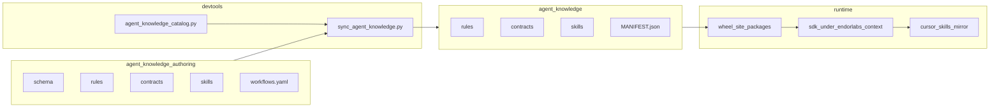

# Endor Labs SDK: AI Agent Integration Guide

> This file is auto-loaded as workspace context for AI agents. It covers architecture, rules, skills, and reference links. For consumer usage see [README.md](README.md). For contributor setup see [CONTRIBUTORS.md](CONTRIBUTORS.md).

## Consuming the SDK

See [README.md](README.md) for installation, configuration, and quick start. **SDK-only mode**
(`Client(...)` without `init()`) is the default for API scripts and automation; see
[SDK-only vs agent bootstrap](#sdk-only-vs-agent-bootstrap) when an agent needs local skills or
platform docs.

Entry point: `endorlabs.Client(tenant="...")`. Key patterns: `client.<ResourceKind>.list()`, `.get()`, `.create()`, `.update()`, `.delete()` where `<ResourceKind>` is **PascalCase** and matches `endorctl api … --resource` (see [docs/contracts.md](docs/contracts.md) — Canonical naming).

```python
import endorlabs

# Example: resource-oriented client with default namespace
client = endorlabs.Client(tenant="tenant.namespace")
namespaces = client.Namespace.list(traverse=True)
projects = client.Project.list(max_pages=2)
```

### Agent notes: projects, findings, and workflows

These apply across tenants and skills; prefer them before assuming `lookup`, `main`, or full-tenant sweeps.

- **Ambiguous project URL:** The same `meta.name` (e.g. identical GitHub URL) may be registered as **multiple** `Project` resources under different child namespaces. `Project.lookup(name=...)` can raise **`AmbiguousError`**. Use `Project.list` with `traverse=True` (and pick `tenant_meta.namespace`), pass an explicit **namespace** to resolution CLIs, or use the **project UUID** from the UI/API.
- **Project-scoped list namespace:** With `Client(tenant=<estate_root>)` and default `traverse=False`, `.list()` hits **only that path segment** — not child namespaces where projects usually live. **Resolve `Project` first**, then pass **`namespace=project.namespace`** on every project-scoped list (`Finding`, `ScanResult`, `PackageVersion`, `DependencyMetadata`). Empty rows often mean **wrong namespace**, not missing data. Use `traverse=True` for **discovery** (`Project.list`); do not rely on implicit client namespace for project RCA. See [docs/contracts.md](docs/contracts.md) (Namespace scoping).
- **Finding branch field:** `spec.source_code_version.ref` is **not** always `refs/heads/main`; it may be a **short branch name** (e.g. default branch label only). Use `RepositoryVersion.list` for the project, or list findings **without** a branch filter first, then narrow once you know stored ref values.
- **Tenant-wide troubleshooting:** `python -m endorlabs.workflows.troubleshooting_scans.fetch_scan_results --all-projects` is **O(projects × scans)** and can run a long time. Prefer **project-scoped** `--project-name` / `--project-uuid` for interactive RCA; reserve all-projects for batch or narrow `--limit` / `--status-filter` windows.
- **Relationship map coverage:** `relationships.map` builds producer edges from a **bounded** `PackageVersion` list (`max_pages` × `page_size`). If `dependency_row_count` is zero, distinguish **unscanned consumers / wrong list namespace** from **pagination truncation** before raising caps (ask before “fetch everything”).
- **List deserialization vs API drift:** Rarely, `client.*.list()` may fail with Pydantic validation on a field the API populated differently than the shipped model (**ServerError** / validation details). That is a **model-sync** or payload-tolerance issue—see **troubleshoot-sdk** and `devtools/sync/`, not something to fix by changing query parameters alone.
- **List field masks (`list_parameters.mask` / facade `mask=`):** The API documents `list_parameters.mask` as a comma-separated **field subset** to return (see local OpenAPI: `list_parameters.mask` — *“List of fields to return (all fields are returned by default).”*). It does **not** define a separate sparse list-row schema. When **no** mask is set (or `mask` is empty / whitespace-only after strip), `client.*.list()` / `list_iter()` return full **Pydantic** resource models as today. When a **non-empty** mask is in effect after the same `ListParameters` merge as `list()`, each row is a shallow-copied **`dict[str, Any]`** (wire JSON shape)—no client-side model construction—so sparse payloads never hit nested required-field validation. **`lookup()`** always returns a typed model: it raises **`ValueError`** if an effective non-empty mask is present; use **`list()`** / **`list_iter()`** for masked dict rows. This is a **breaking change** for callers that passed `mask=` and assumed typed models; migrate with `isinstance(row, dict)` or omit `mask` when you need models. See [docs/guides/consumer-ux-list-update.md](docs/guides/consumer-ux-list-update.md) (filter vs mask) and [docs/changelog.md](docs/changelog.md). Sort + deep pagination constraints are separate; see [docs/contributing/list-query-performance.md](docs/contributing/list-query-performance.md).

## SDK-only vs agent bootstrap

**Default:** agents that only call the API or run workflow CLIs do **not** need `init()` or
`.endorlabs-context/`. Use `endorlabs.Client(...)`, modules under `endorlabs.workflows`, and
[docs.endorlabs.com](https://docs.endorlabs.com/) when online reference is enough.

**Bootstrap when:** the agent reads skills/contracts from disk, greps OpenAPI offline, or writes
workflow outputs under a stable cwd-relative tree.


| Need | Approach |
| ---- | -------- |
| List/get/create resources, run `endorlabs.workflows` CLIs | **SDK-only** — no `.endorlabs-context/` |
| Tier 0–2 navigation (INDEX, MANIFEST, skills) without cwd writes | `endorlabs.agent_knowledge_index_path()` / `agent_knowledge_manifest()` from the installed wheel |
| Cwd-relative skills + optional platform mirror | `endorlabs.init()` |
| Mirror skills into Cursor/Claude runtime dirs | `init(sync_skills="cursor")` (or `"claude"` / `"both"`) after `sdk/` is materialized |


Consumer projects should **gitignore** `.endorlabs-context/` (downloaded docs + `workspace/` outputs).

### Naming

- **Authoring (repo):** `agent-knowledge/` — kebab-case directory paths.
- **Shipped (Python):** `endorlabs.agent_knowledge` — snake_case module (PEP 8).
- **Materialized (runtime):** `.endorlabs-context/sdk/` — unchanged consumer path.

Edit `agent-knowledge/` → run `devtools/sync_agent_knowledge.py` → commit `src/endorlabs/agent_knowledge/`.

## Context Bootstrap (for AI Agents)

Three bootstrap depths (pick the shallowest that fits):

1. **SDK-only** — `Client(...)` only; no agent knowledge materialization.
2. **Wheel-only** — `endorlabs.agent_knowledge_index_path()` points at `site-packages/.../agent_knowledge/INDEX.md`; use `agent_knowledge_manifest()` for skill paths. No auth, no cwd writes.
3. **Local materialization** — `endorlabs.init()` copies the wheel package to `.endorlabs-context/sdk/` and optionally downloads platform context under `platform/`.

```python
import endorlabs

# Wheel-only (no init)
print(endorlabs.agent_knowledge_index_path())

# Minimal local bootstrap (bundle only; no auth)
status = endorlabs.init(include_openapi=False, include_user_docs=False)

# Full bootstrap
status = endorlabs.init()
print(status.agent_knowledge_index_path)   # .endorlabs-context/sdk/INDEX.md
print(status.openapi_path)       # .endorlabs-context/platform/openapi/openapiv2.swagger.json
print(status.user_docs_path)     # .endorlabs-context/platform/user-docs/
print(status.user_docs_count)
```

After `init()`, read **`.endorlabs-context/sdk/INDEX.md`** (Tier 0), then `MANIFEST.json`,
then task skills under `sdk/skills/`. **Non-Cursor harnesses** should prepend
`endorlabs.agent_knowledge_bootstrap_paths()` (INDEX + `rules/` listed in
`MANIFEST.json` → `bootstrap.rule_ids`). Run outputs belong under
`.endorlabs-context/workspace/` (`projects/<uuid>/` for bundles; `sessions/<user>/` for
triage artifacts and temp scripts — see shipped `contracts/workspace-layout.md`).

**Requirements:**
- Authentication (OpenAPI download only): `ENDOR_API_CREDENTIALS_KEY` + `ENDOR_API_CREDENTIALS_SECRET` or `ENDOR_TOKEN`
- Dependencies: `pip install endorlabs-sdk[context]` for user docs download
- Agent knowledge materialization (`include_agent_knowledge=True`, default) requires **no auth**

### Fresh-clone bootstrap

For a repo-local agent session after `git clone`, the SDK consumes **process env / `.env` only**; `endorctl init` does not automatically populate SDK auth.

1. Install the repo with optional extras as needed:
   - `uv sync --extra context` — local OpenAPI/docs bootstrap (`endorlabs.init()`)
   - `uv sync --extra tabular` — DataFrame/Parquet export (`endorlabs.utils.tabular`)
   - `uv sync --extra context --extra tabular` — typical agent + reporting setup
2. Establish credentials in `.env` using one of:
   - API key auth: write `ENDOR_API_CREDENTIALS_KEY`, `ENDOR_API_CREDENTIALS_SECRET`, and optional `ENDOR_NAMESPACE`
   - Browser token refresh: `uv run python devtools/refresh_token_to_dotenv.py --env-file .env` (writes `ENDOR_TOKEN` to `.env`)
3. Verify auth before any heavier workflow:
   - `uv run --env-file .env python -c "import endorlabs; print(endorlabs.Client().whoami())"`
4. Bootstrap local context:
   - `uv run --env-file .env python -c "import endorlabs; endorlabs.init()"`
5. **Contributors editing agent knowledge:** after changes under `agent-knowledge/`, regenerate the shipped package:
   - `uv run python devtools/sync_agent_knowledge.py` (pre-push/CI `--verify` enforces drift)

**Options:**
- `output_dir`: Where to save files (default: `.endorlabs-context`)
- `include_openapi`: Download API spec (default: True)
- `include_user_docs`: Download user docs (default: True)
- `include_agent_knowledge`: Materialize wheel agent knowledge to `sdk/` (default: True)
- `max_pages`: Limit user doc pages (default: all)
- `force`: Re-download even if files exist (default: False)
- `sync_skills`: Mirror materialized `sdk/skills/` into `.cursor/skills/`, `.claude/skills/`, or both (`none`, `cursor`, `claude`, `both`; default: `none`)

This is the recommended way for agents to bootstrap Endor Labs context before performing platform administration tasks.

## Critical Project Rules

- **Canonical naming:** `tenant.namespace.child` only; no UUIDs in paths.
- **Environment variables:** Do not invent names for credentials or SDK settings. Use only variables documented in [README.md](README.md), [CONTRIBUTORS.md](CONTRIBUTORS.md), this guide (including bootstrap above), or in official Endor Labs product/API documentation—and in the local OpenAPI download (`.endorlabs-context/platform/openapi/openapiv2.swagger.json`) when it defines the same purpose. Bearer refresh via `devtools/refresh_token_to_dotenv.py` updates **`ENDOR_TOKEN`** only.
- **Env and security:** Credentials via env; run `endorctl scan` before code changes.
- **Client resource attributes (endorctl parity):** `client.<Kind>` uses **PascalCase** matching `endorctl api … --resource <Kind>` (same as endorctl’s resource syntax). The only non-registry helper on `Client` is **`ScanLogs`** — for fetching log lines; **`ScanLogRequest`** remains the endorctl-aligned resource for scan log *requests*. SDK-only facades use `CustomFacadeEntry` in `registry.py` (including `pyi_*` fields for stub generation); see [docs/contracts.md](docs/contracts.md) (Canonical naming — Custom facades).
- **Return types:** `.get()` and `.lookup()` return typed **`T`**; they raise `NotFoundError` or `AmbiguousError` instead of returning `None`. `.list()` and `.list_iter()` return `list[Resource]` unless a non-empty `mask=` is in effect, then `list[dict[str, Any]]` (see list field masks above). `.create()` and `.update()` return typed models.
- **Field aliasing:** Follows a three-tier rule set (syntax collisions, spec case, semantic renames); see [docs/contracts.md](docs/contracts.md) (Models and API parity -> Field aliasing).
- **Create/update:** Common create/update args may be exposed as explicit optional facade kwargs; validation remains in the resource’s builder and model; the model is the single source of truth for mutable and immutable fields.
- **F() operator semantics:** Import: `from endorlabs import F`. `F().matches(pattern)` is for **string** substring/regex matching on scalar fields (e.g. `F("meta.name").matches("endor-sdk")`). `F().contains(value)` is for **array** membership checks on list fields (e.g. `F("spec.finding_tags").contains("FINDING_TAGS_REACHABLE_FUNCTION")`). Using `contains` on a scalar string field will silently return zero results. The `filter=` parameter on `.list()` accepts `str | FilterExpression | None`.
- **Stdout hygiene:** Production SDK modules under `src/endorlabs/**` must not use `print()`. Use structured logging; keep any `print()` allowances limited to explicit demo entrypoints.
- **Typing policy boundary:** Public SDK surfaces are strict-typed; internal modules follow a staged strictness ratchet (unknown-type diagnostics move from `none` -> `warning` -> `error` by root).

## Automation

Ruff (style, imports, docstrings) and Pyright (typing) are configured in [pyproject.toml](pyproject.toml). CI runs `ruff check .`, `ruff format --check`, `pyright`, `pytest`. Run the same commands locally before pushing. Public API modules are strict-typed; internal roots are tightened incrementally via the pyright execution-environment ratchet. For the exact command list, see [.github/workflows/ci-pr-main.yml](.github/workflows/ci-pr-main.yml).

Commits targeting `main` and `dev` must keep a clean bill-of-health in security scanning: `.github/workflows/ci-pr-main.yml` includes a dedicated Endor Labs CI security scan job (OIDC auth + PR review comments from API findings + SCA/Secrets/SAST/AI SAST), and changes should not merge with unresolved policy-breaking findings under current enforcement settings.

Model-sync drift is enforced by **pre-push hooks** and **CI PR Main** (`--verify-upstream-only` on lint; ephemeral generation for tests). Regenerate committed artifacts in the PR that needs them: `uv run python devtools/model_sync.py --fetch-spec --generate-stubs --generate-reference-docs`. See [docs/contributing/docs-drift-workflow.md](docs/contributing/docs-drift-workflow.md).

**Maintainer commands** (fetch spec, regenerate, compact deltas): [devtools/sync/README.md](devtools/sync/README.md).

## Repository-Scoped Rules (`.cursor/rules/`)

Git-tracked Cursor rules (use **@rule** in chat or rely on glob/always-apply):

| Rule | When it applies |
|------|------------------|
| **Generated `*.mdc`** | Always — from `agent-knowledge/rules/` (SSOT); listed in `.cursor/rules/_generated.json` |
| **docs-skillbase-consistency.mdc** | When editing `**/*.{md,mdc}` — keep docs aligned with `agent-knowledge/`, generated reference, and workflow/CLI inventory |
| **agent-knowledge-authoring.mdc** | When editing `agent-knowledge/**` — follow [agent-knowledge/schema/README.md](agent-knowledge/schema/README.md); run `sync_agent_knowledge.py` after changes |

Regenerate bundle + Cursor rules: `uv run python devtools/sync_agent_knowledge.py`. Portable
example hygiene is **guidance only** — bootstrap rule `portable-examples` (no substring CI gate).

Patterns for LIST/UPDATE, architecture, security, TDD, and code review live in [docs/contributing/](docs/contributing/README.md) (not separate `.mdc` files). For API workflow guidance, use **implement-sdk-resource**; for failures, **troubleshoot-sdk** or [docs/contributing/troubleshooting.md](docs/contributing/troubleshooting.md). Python examples: canonical repo `endorlabs/endorlabs-sdk`; no customer names, UUIDs, or tenant-specific literals.

## Repository layout

Canonical map of repo-root regions and who touches each.

| Region | Role | Who touches it |
|--------|------|----------------|
| [`agent-knowledge/`](agent-knowledge/) | **Authoring** — `rules/`, `contracts/`, `skills/`, `INDEX.md`, `workflows.yaml`, `schema/` (not shipped) | Maintainers |
| [`src/endorlabs/agent_knowledge/`](src/endorlabs/agent_knowledge/) | **Generated ship surface** — `rules/`, `contracts/`, `skills/`, `MANIFEST.json`, workflows; only [`__init__.py`](src/endorlabs/agent_knowledge/__init__.py) hand-maintained | Sync output |
| [`src/endorlabs/`](src/endorlabs/) | **Runtime SDK** — transport, facades, workflows, context bootstrap | Contributors + agents (API) |
| [`src/endorlabs/generated/`](src/endorlabs/generated/) | **Model-sync artifacts** — `registry_contract.py`, OpenAPI-aligned models | Regenerated via `devtools/model_sync.py` |
| [`devtools/`](devtools/) | **Maintainer automation** — model sync, stub/reference gen, `sync_agent_knowledge.py`, `agent_knowledge_catalog.py` | Contributors |
| [`docs/`](docs/) | Normative contracts, guides, contributing playbooks | Contributors |
| [`docs/generated-reference/`](docs/generated-reference/) | Generated API/resource matrices | Regenerated; CI drift gate |
| [`tests/`](tests/) | Unit + integration | CI |
| `.endorlabs-context/` | **Materialized runtime** (gitignored) — `sdk/`, `platform/`, `workspace/` | Agents after `init()` |
| `.cursor/skills/` | Optional IDE mirror of materialized `sdk/skills/` | Cursor runtime |



**Runtime rule:** agents read the **wheel** or **`.endorlabs-context/sdk/`** — never repo `agent-knowledge/` directly.

**Maintainer workflow:**

1. Edit `agent-knowledge/` per [agent-knowledge/schema/README.md](agent-knowledge/schema/README.md)
2. Run `uv run python devtools/sync_agent_knowledge.py` (CI/pre-push `--verify`)
3. Optional IDE mirrors: `init(sync_skills=...)` or `uv run endor-context --no-openapi --no-user-docs --sync-skills cursor`

Authoring rule: [`.cursor/rules/agent-knowledge-authoring.mdc`](.cursor/rules/agent-knowledge-authoring.mdc).

## SDK runtime architecture

Two-layer, registry-driven design inside `src/endorlabs/`. Contributor-deep detail: [docs/contributing/architecture.md](docs/contributing/architecture.md).

```
src/endorlabs/
├── api_client.py              # Layer 1: transport
├── client_surface.py          # Layer 2: Client entry
├── client_surface.pyi         # Generated per-resource facade stub (IDE)
├── facade.py                  # ResourceRuntimeFacade, ScanLogsFacade, …
├── registry.py                # Registry adapter (+ registry_overlay.py)
├── agent_knowledge/              # Generated agent knowledge (wheel); __init__.py only hand-maintained
├── generated/
│   ├── registry_contract.py   # model-sync runtime contract
│   └── models/                # OpenAPI-aligned Pydantic shards
├── resources/                 # Hand-written resource modules + builders
├── models/                    # Small shared hand-written models
├── core/                      # exceptions, F/filter, ListParameters
├── operations/                # BaseResourceOperations
├── utils/                     # model_validation, schema_drift, parallel, …
├── context/                   # endorlabs.init / bootstrap
├── workflows/                 # Composable orchestration (no LLM in core)
└── tools/                     # Standalone utilities (e.g. dependency_explorer)
```

- **Layer 1 — Transport:** `APIClient` — HTTP, auth, retries only.
- **Layer 2 — Resource surface:** `Client` exposes registry-built `ResourceRuntimeFacade[T]` instances; `client_surface.pyi` supplies IDE types.
- **Registry:** `registry_contract.py` + `registry_overlay.py` + experimental entries in `registry.py`.
- **Models:** OpenAPI-aligned shards under `generated/models/`; hand-written deltas in `resources/`.

> **Stub regeneration:** `uv run python devtools/generate_client_stub.py` after registry or facade signature changes.

- **Tools:** `endorlabs.tools` — standalone utilities (e.g. `dependency_explorer`).
- **Workflows:** `endorlabs.workflows` — tenant-facing orchestration (no LLM in core). **Canonical CLI/module inventory:** shipped `MANIFEST.json` → `workflows` and `workflows/entries.json` (includes `endor-context`, `endor-demo`, console scripts, and module-only entry points). See also `[project.scripts]` in [pyproject.toml](pyproject.toml).
- **Internal:** `core`, `operations`, `utils`, `context` (see tree above).

## Reference — External

- **User docs (local):** `.endorlabs-context/platform/user-docs/` — pre-downloaded mirror of docs.endorlabs.com, refreshed by `endorlabs.init()`. **Search here first** using Glob + Read. See `local-context.mdc` for the research protocol.
- **User docs (online):** <https://docs.endorlabs.com/> — fallback only when local docs do not cover the topic.
- **API spec (local):** `.endorlabs-context/platform/openapi/openapiv2.swagger.json` — use for required/optional fields, types, enums, read-only markers. **Grep this file** to confirm field formats before implementing.
- **Agent knowledge (local):** `.endorlabs-context/sdk/` — INDEX.md, MANIFEST.json, `rules/`, `contracts/`, `skills/` (materialized from wheel on every `init()`).
- **API spec (online):** <https://api.endorlabs.com/download/openapiv2.swagger.json> — fallback for freshness checks.
- **Bootstrap:** Create the gitignored `.endorlabs-context/` folder: `uv sync --extra context` then `import endorlabs; endorlabs.init()`. See [Context Bootstrap](#context-bootstrap-for-ai-agents) for options.

## Reference — In-Repo

- **Index:** [docs/README.md](docs/README.md) — what lives where.
- **Contracts:** [docs/contracts.md](docs/contracts.md) — naming, traverse, ListParameters, OpenAPI path, models and API parity, update_mask, errors.
- **Design notes:** [docs/design.md](docs/design.md) — rationale and tradeoffs for SDK behavior.
- **Consumer UX (list/update):** filter vs mask, flat kwargs — [docs/contracts.md](docs/contracts.md), [docs/guides/consumer-ux-list-update.md](docs/guides/consumer-ux-list-update.md).
- **Reference:** [docs/reference/README.md](docs/reference/README.md) (curated index and stable landing pages), [docs/generated-reference/resources.md](docs/generated-reference/resources.md) (canonical generated operations matrix), [docs/generated-reference/api-surfaces.md](docs/generated-reference/api-surfaces.md), [docs/generated-reference/create-update-payloads.md](docs/generated-reference/create-update-payloads.md), [docs/reference/namespace.md](docs/reference/namespace.md) (list/get/create/update/delete).
- **Guides:** [docs/guides/README.md](docs/guides/README.md); consumer-ux-list-update, retrieving-scan-results.
- **Contributing:** [docs/contributing/README.md](docs/contributing/README.md); architecture, api-validation, integration-resource-tests, troubleshooting, docs-drift-workflow.

## Agent Skills (On-Demand Workflows)

Discovery table below; progressive disclosure, schema, and runtime paths: [agent-knowledge/README.md](agent-knowledge/README.md).

| Skill | When to use | Entry |
|-------|-------------|-------|
| [analytics-estate-dependencies](agent-knowledge/skills/analytics-estate-dependencies/) | Estate DependencyMetadata aggregates, version cardinality, CVE remediation comparison | `endor-analytics-export-deps` |
| [custom-sast-rules](agent-knowledge/skills/custom-sast-rules/) | Threat modeling, authoring, or importing OpenGrep/Semgrep rules | `endor-semgrep-inventory` |
| [dependency-finding-provenance](agent-knowledge/skills/dependency-finding-provenance/) | Trace vulnerability/dependency lineage; fixed vs present at branch/commit scope | Playbook |
| [dependency-provenance](agent-knowledge/skills/dependency-provenance/) | Resolve package-version lineage by manifest path and ref/sha | Playbook |
| [project-agent-context](agent-knowledge/skills/project-agent-context/) | Multi-pass project context bundle; see `MULTIPASS_LLM_CONTRACT.md` | `endor-agent-context` |
| [map-project-dependency-relationships](agent-knowledge/skills/map-project-dependency-relationships/) | Namespace-wide project dependency graph (JSON) | `python -m endorlabs.workflows.relationships.map` |
| [fetch-and-search-call-graph](agent-knowledge/skills/fetch-and-search-call-graph/) | Fetch, decode, and search call graph artifacts | `endor-callgraph-search` |
| [implement-sdk-resource](agent-knowledge/skills/implement-sdk-resource/) | Model-sync-first surface extension, overlay, integration tests | `devtools/model_sync.py` |
| [model-sync-drift](agent-knowledge/skills/model-sync-drift/) | OpenAPI/provenance drift; regen generated artifacts | `devtools/sync/` |
| [retrieve-scan-results](agent-knowledge/skills/retrieve-scan-results/) | Querying projects, scan results, and findings | Playbook |
| [reachability-provenance](agent-knowledge/skills/reachability-provenance/) | Triaging conflicting reachability signals on findings | `endor-reachability-context` |
| [sso-integration-validation-troubleshooting](agent-knowledge/skills/sso-integration-validation-troubleshooting/) | Customer SSO setup, validation, claims-to-namespace troubleshooting | Playbook |
| [troubleshooting-scans](agent-knowledge/skills/troubleshooting-scans/) | Scan regressions; ScanResults, ScanLogs, scripted diffs | `python -m endorlabs.workflows.troubleshooting_scans` |
| [troubleshoot-sdk](agent-knowledge/skills/troubleshoot-sdk/) | Debugging 404s, 500s, namespace mismatches, test failures | Playbook |
| [troubleshoot-authlog](agent-knowledge/skills/troubleshoot-authlog/) | AuthenticationLog, AuthorizationPolicy, SSO/login troubleshooting | Playbook |
| [validate-policy](agent-knowledge/skills/validate-policy/) | Validate policies against project findings | `python -m endorlabs.workflows.policies.validate` |

At runtime, read skills from the wheel or `.endorlabs-context/sdk/skills/` (`.cursor/skills` when mirrored). Repo `agent-knowledge/skills/` is authoring only; bootstrap rules ship under `sdk/rules/`.

CI runs these (except optional endorctl); include pyright. Unit tests run without credentials; integration tests require `ENDOR_*` env vars.

---

Index for AI agents; in-repo behavior and patterns are defined by `.cursor/rules/*.mdc`, [docs/contributing/](docs/contributing/README.md), skills above, and the linked docs.
