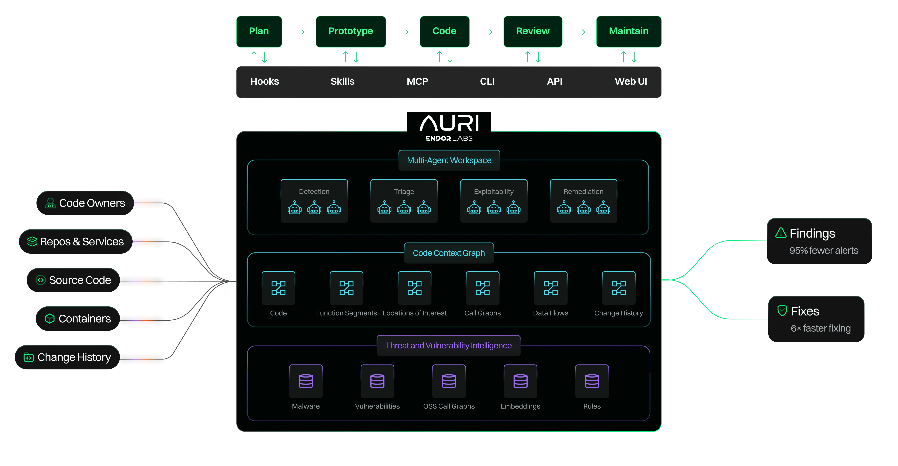

# Endor Labs SDK

<p align="center">
  <a href="https://www.endorlabs.com/">
    <picture>
      <source media="(prefers-color-scheme: dark)" srcset="docs/assets/endor-labs-wordmark-dark.png">
      <source media="(prefers-color-scheme: light)" srcset="docs/assets/endor-labs-wordmark-light.png">
      
    </picture>
  </a>
</p>

<p align="center">
  <a href="https://www.endorlabs.com/platform">
    
  </a>
</p>

<p align="center">
  <a href="https://www.endorlabs.com/platform">AURI platform</a> ·
  <a href="https://docs.endorlabs.com/">Platform docs</a> ·
  <a href="#quick-start">Quick start</a>
</p>

[Python CI](https://github.com/endorlabs/endorlabs-sdk/actions/workflows/ci-pr-main.yml)

Type-safe, resource-oriented Python client for the Endor Labs REST API. List, get, create, update, and delete resources (projects, findings, scan results, policies, namespaces, and [the rest of the registry-backed resource set](docs/generated-reference/resources.md)) with consistent patterns for filtering, pagination, namespace traversal, and IDE-friendly typed facades.

- **Python:** 3.12+ (CI gates run on 3.13 — see [CONTRIBUTORS.md](CONTRIBUTORS.md))
- **API spec:** [OpenAPI (Swagger)](https://api.endorlabs.com/download/openapiv2.swagger.json)

## Start here


| You want to…                                        | Go to                                                                                          |
| --------------------------------------------------- | ---------------------------------------------------------------------------------------------- |
| **Use the SDK** (API scripts, CI)                   | [Installation](#installation) → [Quick start](#quick-start) — **no `init()` required**         |
| **Bootstrap an AI agent** (API + skills)            | [Agent bootstrap](#agent-bootstrap-discover-vs-init) — `discover()` then `init()` for workflows |
| **Try the SDK on a real tenant**                    | [docs/guides/examples.md](docs/guides/examples.md) · [Try it with skills](#try-it-with-skills) |
| **SDK contracts and deep reference**                | [docs/README.md](docs/README.md)                                                               |
| **Contribute to this repo**                         | [CONTRIBUTORS.md](CONTRIBUTORS.md)                                                             |


## Installation

```bash
pip install endorlabs
```

Or with [uv](https://github.com/astral-sh/uv):

```bash
uv add endorlabs
```

From the repository (editable):

```bash
git clone https://github.com/endorlabs/endorlabs-sdk.git
cd endorlabs-sdk
uv sync
# or: pip install -e .
```

Verify: `uv run python -c "import endorlabs; print(endorlabs.__version__)"`

Source repo: [`endorlabs/endorlabs-sdk`](https://github.com/endorlabs/endorlabs-sdk) — PyPI distribution name is **`endorlabs`** (`import endorlabs`).

### Optional extras


| Extra       | Install                                  | Enables                                                                                                      |
| ----------- | ---------------------------------------- | ------------------------------------------------------------------------------------------------------------ |
| `docs`      | `pip install 'endorlabs[docs]'`        | User-docs sync (`include_user_docs=True`); OpenAPI download works on the base install                       |
| `analytics` | `pip install 'endorlabs[analytics]'`    | DataFrame / Parquet export and estate graph metrics — see [docs/estate/README.md](docs/estate/README.md) |


CSV export from `workflows.estate.analyze.cardinality.tabular` works without extras. In this repo: `uv sync --extra docs --extra analytics`.

## Quick start

**SDK-only** — examples below do not call `endorlabs.init()`. For agent bootstrap, see [AGENTS.md](AGENTS.md).

Entry point: `endorlabs.Client(tenant=...)`. Resources are **PascalCase** facades (`client.Project`, `client.Finding`, …) matching `endorctl api … --resource <Kind>`.

### Basic usage

```python
import os
import endorlabs

client = endorlabs.Client(
    tenant=os.getenv("ENDOR_NAMESPACE", "your-tenant.namespace"),
    logging_level="ERROR",
)

namespaces = client.Namespace.list(traverse=True)
projects = client.Project.list(traverse=True, max_pages=1)

if projects:
    project = client.Project.get(projects[0].uuid)
    print(project.meta.name)
```

**List field masks:** a non-empty `mask=` on `list()` returns `list[dict]` wire JSON rows, not
full Pydantic models. Omit `mask` when you need typed resources end-to-end. See
[docs/guides/consumer-ux-list-update.md](docs/guides/consumer-ux-list-update.md).

**Large estate lists:** for project-scoped resources at scale, use
[`endorlabs.tools.list_sharding`](src/endorlabs/tools/list_sharding.py) or the `endor-estate`
workflow CLI (see [docs/contributing/list-query-performance.md](docs/contributing/list-query-performance.md)).

### Requesting a scan and waiting for results

```python
repo_url = "https://github.com/tgowan-endor/BenchmarkJava.git"
projects = client.Project.search_by_name(repo_url, traverse=True, max_pages=2)
project = projects[0] if projects else None

client.Project.update(project, scan_state="SCAN_STATE_REQUEST_FULL_RESCAN")

client.wait_until(
    lambda: (
        (p := client.Project.get(project))
        and p.processing_status.scan_state == "SCAN_STATE_IDLE"
    ),
    timeout=300,
)

scans = client.ScanResult.list_by_project(project, limit=1)
latest_scan = scans.values[0] if scans.values else None  # RouteResult → use .values
findings = client.Finding.list_for_context(latest_scan, max_pages=1) if latest_scan else None
```

**Relationship accessors** (`list_by_project`, `list_for_context`, …) return `RouteResult`, not a plain `list` — use `.values` or `.value`. Prefer them over hand-built filters when the edge exists in the contract. Catalog: [docs/generated-reference/resource-routes.md](docs/generated-reference/resource-routes.md) · guide: [docs/guides/facade-helpers.md](docs/guides/facade-helpers.md).

**Pagination on `.list()`:** `limit=N` is an alias for `page_size=N` (same idea as `list_by_project(..., limit=N)`). Use `max_pages` to cap fetch depth.

More patterns (filters, `F()`, masks, namespace scoping): [docs/guides/consumer-ux-list-update.md](docs/guides/consumer-ux-list-update.md), [docs/guides/retrieving-scan-results.md](docs/guides/retrieving-scan-results.md).

### Transport-only `APIClient`

```python
from endorlabs import APIClient

client = APIClient()
response = client.get("v1/namespaces/tenant.namespace/projects")
```

Prefer `endorlabs.Client` for typed models and namespace handling.

## Configuration

The SDK uses **environment variables** only (no config file loading). Precedence: constructor arguments → environment variables → built-in defaults.


| Variable                       | Purpose                                                   |
| ------------------------------ | --------------------------------------------------------- |
| `ENDOR_API`                    | API base URL (default: `https://api.endorlabs.com`)       |
| `ENDOR_API_CREDENTIALS_KEY`    | API key                                                   |
| `ENDOR_API_CREDENTIALS_SECRET` | API secret                                                |
| `ENDOR_TOKEN`                  | Bearer token; validated first when set                    |
| `ENDOR_NAMESPACE`              | Default tenant namespace (e.g. `tenant.namespace`)        |
| `ENDOR_LOG_LEVEL`              | Optional: `DEBUG`, `INFO`, `WARNING`, `ERROR`, `CRITICAL` |
| `ENDOR_MAX_RETRIES`            | Optional: retry count (default: 5)                        |


Canonical naming is `tenant.namespace.child`; do not use UUIDs in namespace paths. Full semantics: [docs/contracts.md](docs/contracts.md).

Example `.env` for local runs — use **one** credential mode (not both):

```bash
# Option A — bearer token (common for agent sessions)
ENDOR_TOKEN=your-bearer-token
ENDOR_NAMESPACE=your-tenant.namespace
ENDOR_LOG_LEVEL=INFO
```

```bash
# Option B — API key (CI)
ENDOR_API_CREDENTIALS_KEY=your-api-key
ENDOR_API_CREDENTIALS_SECRET=your-api-secret
ENDOR_NAMESPACE=your-tenant.namespace
ENDOR_LOG_LEVEL=INFO
```

If both token and API key variables are set, the SDK prefers the token; **MCP and endorctl** typically fail with conflicting auth.

### Agent bootstrap: `discover()` vs `init()`

| Need | Approach |
| ---- | -------- |
| INDEX, contracts, traps, stub path — **no cwd writes** | `print(endorlabs.discover())` or `python -m endorlabs.examples.agent_bootstrap --dry-run` — then read every `bootstrap_paths` entry |
| Skill playbooks on disk (call graph, scan RCA, bundles) | `endorlabs.init()` → `.endorlabs-context/sdk/skills/<id>/SKILL.md` |
| Platform OpenAPI / user docs offline | `pip install 'endorlabs[docs]'` then `init(include_openapi=True, include_user_docs=True)` |

Runnable probe (paths only): `python -m endorlabs.examples.agent_bootstrap --dry-run`. Shipped consumer guide: `discover().agents_guide`.

**Call graphs (agents):** `CallGraphData.fetch()` returns the raw envelope only. For search and path queries, read skill **`endor-fetch-and-search-call-graph`** after `init()` (or from the wheel: `skills/endor-fetch-and-search-call-graph/SKILL.md` via `agent_knowledge_manifest()`). Prefer `endorlabs.workflows.callgraph.resolve_package_version_with_callgraph()` and `CallGraphData.decode()` — `spec.call_graph_available` does not guarantee stored graph data. Pass `namespace=project.tenant_meta.namespace` on PV lists and decode.

### AI agents

Before `Client()`, run `print(endorlabs.discover())` (or `agent_bootstrap --dry-run`) and read every path in `bootstrap_paths`. Before **workflow** tasks (call graph, project bundle, scan RCA), run `endorlabs.init()` and open the relevant skill under `.endorlabs-context/sdk/skills/`.

Browser auth, SSO setup, and skill walkthroughs: [docs/guides/examples.md](docs/guides/examples.md).

## Try it with skills

Guided tenant sessions use shipped agent skills — start with [docs/guides/examples.md](docs/guides/examples.md). Wheel entry: `print(endorlabs.discover())` or `agent_bootstrap --dry-run`; materialize with `init()` to `.endorlabs-context/sdk/`.

## Further reading

- **SDK docs:** [docs/README.md](docs/README.md) — contracts, guides, generated reference, errors
- **API surfaces:** [docs/reference/api-surfaces.md](docs/reference/api-surfaces.md)
- **Architecture (contributors):** [docs/contributing/architecture.md](docs/contributing/architecture.md)
- **Agents:** [AGENTS.md](AGENTS.md) — bootstrap, workflows inventory, naming
- **Contribute:** [CONTRIBUTORS.md](CONTRIBUTORS.md) · [devtools/README.md](devtools/README.md)

## License

MIT. See [LICENSE](LICENSE).
