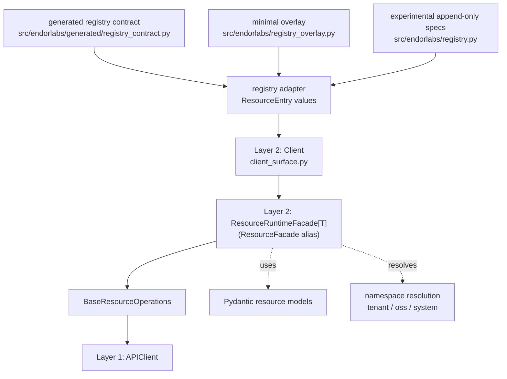

# SDK architecture (contributing)

Two runtime layers plus registry-driven contract inputs define the Endor Labs SDK.
Use this when editing the client surface, facade, or registry, or when adding
resources to the Client. See [AGENTS.md](../../AGENTS.md) (Architecture) for the
short reference.

## Layers

1. **Transport (`APIClient`)** — `api_client.py`
   - HTTP, auth, retries only. No resource concepts; no Pydantic models.
   - Do not add tenant or resource accessors here.

2. **Resource surface (`Client`)** — `client_surface.py`
   - Holds default namespace and exposes resource facades (e.g. `client.Namespace`, `client.Project`).
   - Builds facades from the effective registry; do not hand-wire each resource in `Client.__init__`.

3. **Facade (`ResourceRuntimeFacade[T]`)** — `facade.py`
   - Resolves namespace, builds `ListParameters` from convenience kwargs, and delegates CRUD/list behavior to `BaseResourceOperations`.
   - `ResourceFacade` remains as a backward-compatible alias, but the runtime implementation is `ResourceRuntimeFacade`.
   - A single facade class handles all scopes via the `scope` property (`None` for tenant, `"oss"`, or `"system"`).
   - Enforces supported operations from registry metadata; unsupported methods raise `NotImplementedError`.

4. **Registry adapter** — generated-contract + overlay source of truth for `Client`
   - Runtime contract is generated at `src/endorlabs/generated/registry_contract.py` by `devtools/model_sync.py`.
   - `registry.py` adapts generated contract rows into `ResourceEntry(...)` objects, applies explicit overrides from `registry_overlay.py`, and appends narrowly scoped experimental facades when needed.
   - Prefer model-sync inputs plus the minimal overlay. Use experimental facades only as explicit, lightweight stopgaps instead of hand-authoring a large registry table.

## Rules

- **No coupling:** APIClient does not import or depend on resources, facade, or registry. Only the Client/facade layer depends on resource modules.
- **Contract-driven:** New resources normally come from model-sync generated contract data plus explicit overlay when needed. Experimental append-only facades live in `registry.py` and should stay minimal.
- **Facade delegates to BaseResourceOperations:** The facade instantiates `BaseResourceOperations` from registry metadata and delegates CRUD calls to it. Resource modules contain Pydantic models and convenience functions only; no module-level CRUD wrappers.
- **Types:** Use `ResourceRuntimeFacade[T]` with the Pydantic model as `T` so `client.Namespace.list()` is typed as `list[Namespace]`; the `ResourceFacade` alias remains for compatibility.

## Contributing to the generated surface

New API resources are **modeled by model sync**, not hand-added to `Client` one at a time. The default workflow:

1. **Regenerate** — `uv run python devtools/model_sync.py --fetch-spec --generate-stubs --generate-reference-docs` (see [docs-drift-workflow.md](docs-drift-workflow.md)).
2. **Verify contract** — Resource appears in `src/endorlabs/generated/registry_contract.py`; facade is attached at runtime from the registry adapter (no entry in `Client.__init__`).
3. **Validate API shape** — [api-validation.md](api-validation.md) (OpenAPI + optional endorctl list/get).
4. **Diverge only when needed** — [registry_overlay.py](../../src/endorlabs/registry_overlay.py) for scope, ops, or metadata the generator cannot express; keep overrides minimal.
5. **Hand-written `resources/` modules** — Use for `build_create_payload`, field aliasing, convenience helpers, and schema drift hooks when generated shards are insufficient. Confirm model-sync parity before large manual deltas.
6. **Integration tests** — [integration-resource-tests.md](integration-resource-tests.md).
7. **Custom facades** — Rare; append-only experimental entries in `registry.py` (e.g. workflow helpers). Prefer contract + overlay first.

### Canonical generation policy

- Mapping is from `.endorlabs-context/openapiv2.swagger.json` to deterministic Pydantic modules under `src/endorlabs/generated/models/`.
- Eligibility defaults to include when `x-internal != true`, with explicit allowlist exceptions in model-sync profiles when metadata is incomplete.
- Mapping must be deterministic (stable bucketing, naming, `entity -> module` manifest).

### Facade behavior (no per-resource CRUD modules)

- `ResourceRuntimeFacade` delegates `list`, `get`, `create`, `update`, `delete` to `BaseResourceOperations` using registry metadata.
- `update_mask` at the facade is a comma-separated string; UUID+payload updates require an explicit mask.
- Create/update field allowlists: `build_create_payload` and model `get_mutable_fields_cls()` / `get_immutable_fields_cls()`; see [contracts.md](../contracts.md) (field aliasing, consumer UX).
- Errors: use `endorlabs` exception types; preserve full response text in logs.

## When to Use

- Editing `client_surface.py`, `facade.py`, `registry.py`, or `registry_overlay.py`.
- Regenerating or overriding the client surface after OpenAPI changes.
- Adding integration tests or custom workflow facades — not for duplicating generated models in docs.
