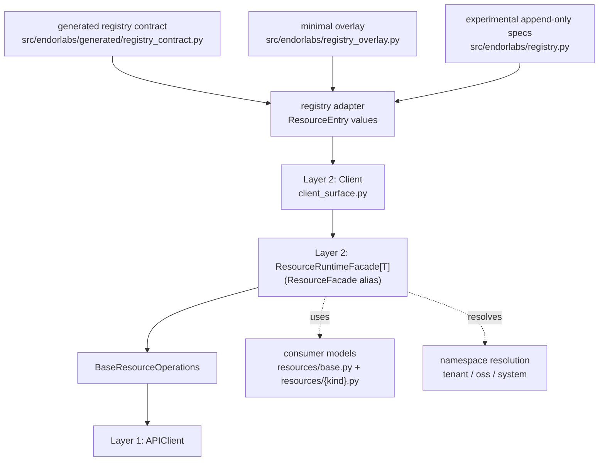
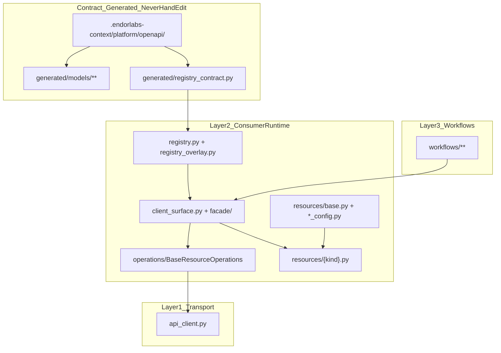
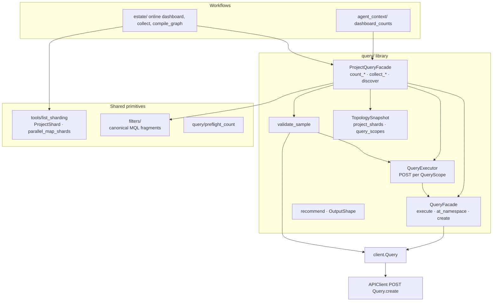

# SDK architecture (contributing)

Two runtime layers plus registry-driven contract inputs define the Endor Labs SDK.
Use this when editing the client surface, facade, or registry, or when adding
resources to the Client. Repo map: [repository-layout.md](repository-layout.md). Agent bootstrap: [AGENTS.md](../../AGENTS.md).

## Layers

1. **Transport (`APIClient`)** — `api_client.py`
   - HTTP, auth, retries only. No resource concepts; no Pydantic models.
   - Do not add tenant or resource accessors here.

2. **Resource surface (`Client`)** — `client_surface.py`
   - Holds default namespace and exposes resource facades (e.g. `client.Namespace`, `client.Project`).
   - Builds facades from the effective registry; do not hand-wire each resource in `Client.__init__`.

3. **Facade (`ResourceRuntimeFacade[T]`)** — `facade/` package (`base.py`, `runtime.py`, `specialized.py`)
   - Resolves namespace, builds `ListParameters` from convenience kwargs, and delegates CRUD/list behavior to `BaseResourceOperations`.
   - `ResourceFacade` remains as a backward-compatible alias, but the runtime implementation is `ResourceRuntimeFacade`.
   - A single facade class handles all scopes via the `scope` property (`None` for tenant, `"oss"`, or `"system"`).
   - Enforces supported operations from registry metadata; unsupported methods raise `NotImplementedError`.

4. **Registry adapter** — generated-contract + overlay source of truth for `Client`
   - Runtime contract is generated at `src/endorlabs/generated/registry_contract.py` by `devtools/model_sync.py`.
   - `registry.py` adapts generated contract rows into `ResourceEntry(...)` objects, applies explicit overrides from `registry_overlay.py`, and appends narrowly scoped experimental facades when needed.
   - Prefer model-sync inputs plus the minimal overlay. Use experimental facades only as explicit, lightweight stopgaps instead of hand-authoring a large registry table.

## Rules

- **No coupling:** APIClient does not import or depend on resources, facade, or registry. Only the Client/facade layer depends on resource modules.
- **Contract-driven:** New resources normally come from model-sync generated contract data plus explicit overlay when needed. Experimental append-only facades live in `registry.py` and should stay minimal.
- **Facade delegates to BaseResourceOperations:** The facade instantiates `BaseResourceOperations` from registry metadata and delegates CRUD calls to it. Resource modules contain Pydantic models and convenience functions only; no module-level CRUD wrappers.
- **Types:** Use `ResourceRuntimeFacade[T]` with the Pydantic model as `T` so `client.Namespace.list()` is typed as `list[Namespace]`; the `ResourceFacade` alias remains for compatibility.

## Contributing to the generated surface

New API resources are **modeled by model sync**, not hand-added to `Client` one at a time. The default workflow:

1. **Regenerate** — `uv run python devtools/model_sync.py --fetch-spec --generate-stubs --generate-reference-docs` (see [docs-drift-workflow.md](docs-drift-workflow.md)).
2. **Verify contract** — Resource appears in `src/endorlabs/generated/registry_contract.py`; facade is attached at runtime from the registry adapter (no entry in `Client.__init__`).
3. **Validate API shape** — [api-validation.md](api-validation.md) (OpenAPI + optional endorctl list/get).
4. **Diverge only when needed** — [registry_overlay.py](../../src/endorlabs/registry_overlay.py) for scope, ops, or metadata the generator cannot express; keep overrides minimal.
5. **Hand-written `resources/` modules** — Extend `resources.base.BaseResource` / `BaseSpec` for `Client` return types; use for `build_create_payload`, field aliasing (Tier 3 → `resources/field_aliases.py`), convenience helpers, and `extra="allow"` forward compat when generated shards are insufficient. Confirm model-sync parity before large manual deltas.
6. **Integration tests** — [integration-resource-tests.md](integration-resource-tests.md).
7. **Custom facades** — Rare; append-only experimental entries in `registry.py` (e.g. workflow helpers). Prefer contract + overlay first.

### Canonical generation policy

- Mapping is from `.endorlabs-context/platform/openapi/openapiv2.swagger.json` to deterministic Pydantic modules under `src/endorlabs/generated/models/` (wire mirror only — not the consumer types in `resources/`).
- Eligibility defaults to include when `x-internal != true`, with explicit allowlist exceptions in model-sync profiles when metadata is incomplete.
- Mapping must be deterministic (stable bucketing, naming, `entity -> module` manifest).

### Facade behavior (no per-resource CRUD modules)

- `ResourceRuntimeFacade` delegates `list`, `get`, `create`, `update`, `delete` to `BaseResourceOperations` using registry metadata.
- `update_mask` at the facade is a comma-separated string; UUID+payload updates require an explicit mask.
- Create/update field allowlists: `build_create_payload` and model `get_mutable_fields_cls()` / `get_immutable_fields_cls()`; see [contracts.md](../contracts.md) (field aliasing, consumer UX).
- Errors: use `endorlabs` exception types; preserve full response text in logs.

## Consumer vs generated models

Two model planes: **wire truth** in `generated/models/` and **consumer runtime** in
`resources/`. Wire golden tests: `tests/fixtures/models/{module}/list_row_min.json`
(gated by `devtools/audit_consumer_surfaces.py --check`).

| Plane | Location | Role |
| ----- | -------- | ---- |
| **Wire truth** | `src/endorlabs/generated/models/**`, `generated/registry_contract.py` | OpenAPI-shaped `V1*` types, CRUD metadata — **never hand-edit** |
| **Consumer runtime** | `resources/{kind}.py`, `resources/consumer/`, `*_config.py` | What `Client.*.list()` / `get()` deserialize into; mask tolerance, `.update()`, `build_create_payload` |

**Consumer pattern:** `class Kind(V1Kind, ConsumerResourceWireMixin, ConsumerResourceMixin)` with registry-backed mutable/immutable field lists from `resources/consumer/registry_fields.py`. Legacy `BaseResource` in `resources/base.py` remains for compat only.

**Naming rule:** `generated/models` = wire mirror; `resources/` = consumer types for the primary registry kinds (plus wire helpers such as `call_graph_data*.py`).

**Policy nested specs:** [`finding_config.py`](../../src/endorlabs/resources/finding_config.py), [`notification_config.py`](../../src/endorlabs/resources/notification_config.py), and [`exception_config.py`](../../src/endorlabs/resources/exception_config.py) are intentional siblings on [`BaseSpec`](../../src/endorlabs/resources/base.py). They align with product policy UI tabs (finding / notification / exception lifecycle). Policy types may use different action shapes; fields belong in the OpenAPI model and consumer configs document known keys with `extra="allow"`.

**API shape drift:** Primary detection is **model-sync regen** + **CI parity** ([docs-drift-workflow.md](docs-drift-workflow.md), `verify_ship_artifacts.py`). Consumer specs use `extra="allow"` so unknown API keys do not break parse. Optional maintainer wire-key probes: `from endorlabs.utils.schema_drift import log_unknown_wire_keys` — **not** in `endorlabs.utils.__all__`; never hooked into default model validation.

Tier 3 semantic aliases: [`resources/field_aliases.py`](../../src/endorlabs/resources/field_aliases.py) — [contracts.md](../contracts.md#field-aliasing).

**Consumer modules** use thin `V1*` wrappers plus `resources/consumer/` mixins; keep
`resources/{kind}.py` for payload builders and facade sugar.

## Query and estate composition (Layer 3+)

Workflows orchestrate **either** facade list/count **or** Query graph joins. The Query stack is library code under `src/endorlabs/query/` plus a custom registry facade — not a fourth transport layer.

### Surface split

| Entry | Location | Role |
| ----- | -------- | ---- |
| **`client.Query`** | `facade/specialized.py` → `QueryFacade` | Generic joins: `create`, `execute(spec, scopes, parse=…)`, `at_namespace` |
| **`client.Query.Project`** | `query/project_facade.py` | Project-root recipes: `discover`, `count_pv`, `count_dm`, `count_findings_by_category`, `collect_estate_findings`, `validate_sample` |
| **`endorlabs.query`** | `query/__init__.py` | Library exports: `QuerySpec`, `QueryScope`, `discover_topology`, `validate_sample`, `recommend`, spec builders — **no module-level `count_*` execution** |
| **`endorlabs.filters`** | `filters/` | Canonical MQL for Query wire specs and facade `filter=` (main context, categories, project scope) |

`QueryExecutor` resolves `Query.create` through **`QueryFacade`** (or `Client.Query`), not bare `APIClient`. `ProjectQueryFacade` builds minimal registry facades when it needs `Project.list` / `PackageVersion.count` for discovery and validation.

### Topology and sharding

One bounded **`Project.list`** discovery produces **`TopologySnapshot`**:

- `topology.projects` — deduped project rows
- `topology.namespace_geometry` — per-leaf-namespace stats (was `NamespaceShard`)
- `topology.project_shards()` — `ProjectShard` list for **facade** parallel lists (`tools/list_sharding`)
- `topology.query_scopes()` — `QueryScope` list for **Query POST** batching (grouped by wire namespace)

List-plane sharding (`list_for_shards`, estate DM collect) and query-plane joins (`count_pv`, `collect_estate_findings`) share discovery but use different execution paths. See [list-query-performance.md](list-query-performance.md) and [guides/query-recipes.md](../guides/query-recipes.md).

### Validation before scale

`validate_sample` compares Query recipe output to facade `count()` on a bounded project sample (`recipe="pv"|"dm"|"findings"`). Estate dashboard and online counts call `client.Query.Project.validate_sample` before full `count_*` runs. Maintainer live checks: `.tmp/query_workflow_probes/validate_query_facade.py`.

### When to use Query vs facade

Query is **kind-agnostic** at the wire level. **`client.Query.Project.*`** is one validated recipe family for estate dashboard patterns.

| Ask | Path |
| --- | ---- |
| Namespace-scoped count/filter (any kind) | `Query.at_namespace` + `QuerySpec.root("<Kind>")` or facade `count()` — probe parity |
| Dashboard counts across many projects | `client.Query.Project.count_*` after `validate_sample` |
| Masked finding rows (estate collect) | `client.Query.Project.collect_estate_findings` after probe |
| One project RCA / full finding rows | `Finding.list_by_project` |
| FindingLog trends, DM version buckets | Facade `list_groups` today (Query `group` / `group_by_time` = probe) |
| Custom graph join | `QuerySpec` + `client.Query.execute` |

Normative routing: shipped contract `query-vs-list-semantics.md` (wheel / `agent-knowledge/contracts/`). Agent skill: `endor-route-estate-queries`.

## When to Use

- Editing `client_surface.py`, `facade/`, `registry.py`, `registry_overlay.py`, **`facade/specialized.py` (QueryFacade)**, or **`query/`** (recipes, executor, topology).
- Regenerating or overriding the client surface after OpenAPI changes.
- Adding integration tests or custom workflow facades — not for duplicating generated models in docs.
