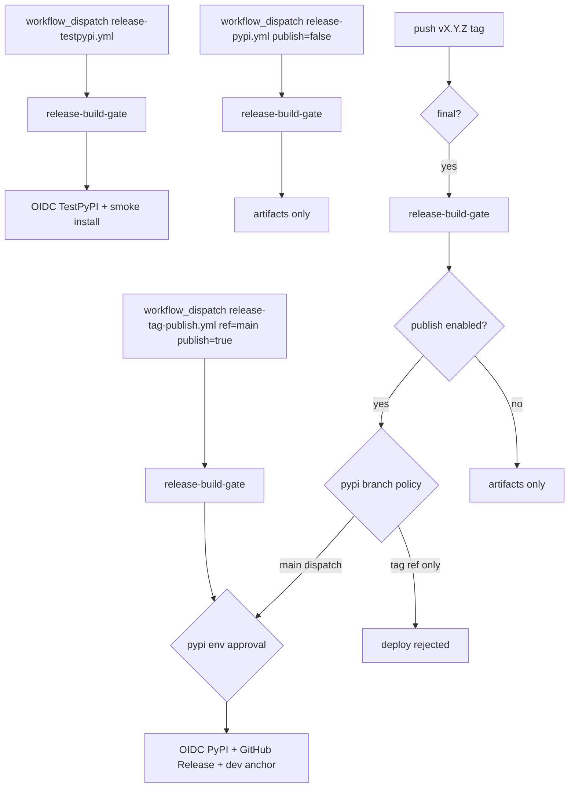

# Release and PyPI publishing

Maintainer guide for version tags, hatch-vcs, OIDC trusted publishing, and release CI.

Configure **pending** Trusted Publishing on TestPyPI and PyPI before the first upload to each index.

## hatch-vcs and dev tags

`hatch-vcs` delegates to **setuptools-scm**. SCM computes post-tag versions as
`{tag_base}.dev{N}` where **N = commits since the tag**.

That only works when the tag ends in **`.dev0`** (dev-series anchor), e.g. `v0.1.1.dev0` →
`0.1.1.dev4` four commits later.

Tags like **`v0.1.1.dev19`** encode “dev 19” in the tag itself. SCM then refuses to bump
(“choosing custom numbers for the `.devX` distance is not supported”) and **`uv sync` /
editable installs fail**—the error in local Endor scans against `pypi://endorlabs@…`.

**Repo fix (in `pyproject.toml`):**

1. **`[tool.hatch.version.raw-options].git_describe_command`** — development trees describe only
   `v*.*.*.dev0` anchors (so `0.1.1.dev23`, not `0.1.1.dev19` from a bad tag).
2. **Release CI** — `.github/workflows/release-tag-publish.yml` sets
   `SETUPTOOLS_SCM_PRETEND_VERSION` from the pushed tag (`v0.1.0` → `0.1.0`) so wheels are
   exactly the release version, not a `.devN` distance.
3. **`local_scheme = "no-local-version"`** — wheels do not get `+g<hash>` suffixes (PyPI-friendly).
4. Do **not** put `tag-pattern` on `[tool.hatch.version]` with a group that includes `.dev0` in the
   captured version (e.g. `0.1.1.dev0`) — setuptools-scm treats that as a custom dev id and fails.

The active dev anchor is the newest **`v*.*.*.dev0`** tag on the remote (check with
`git fetch --tags && git tag -l 'v*.dev0' --sort=-v:refname | head -1`). SCM then emits
`X.Y.Z.devN` for `N` commits after that anchor. Release CI sets `SETUPTOOLS_SCM_PRETEND_VERSION`
so builds do not depend on deep git history (`fetch-depth: 1` on release workflows).

**Remote tag hygiene (recommended):** delete or stop creating tags that break SCM
(`v0.1.1.dev19`, `v0.1.0.dev1`, `v0.1.0-test.*`, `v0.1.1.dev-build.*`). The describe command
mitigates them, but cleaning the remote avoids confusion for other tools (Endor scans, `git describe`).

## PEP 440 and PyPI rules (summary)

| Rule | Practice for this package |
|------|---------------------------|
| Public release versions | `X.Y.Z` only on PyPI (e.g. `0.1.0`)—tag `v0.1.0` at the release commit |
| Pre-releases | `X.Y.Za1`, `X.Y.Zb1`, `X.Y.Zrc1` if needed; tag `v0.2.0rc1` |
| Dev series (local/TestPyPI only) | Anchor `vX.Y.Z.dev0`; SCM emits `X.Y.Z.devN` between anchors |
| **Do not** use custom `.devN` in tags | No `v0.1.1.dev19`—use git distance instead |
| Local segments `+gHASH` | Stripped for wheels via `local_scheme = "no-local-version"` in `pyproject.toml` |
| TestPyPI | Same version strings; upload there first, smoke-install, then PyPI |

PyPI rejects many local-version forms on upload. **Release CI** sets
`SETUPTOOLS_SCM_PRETEND_VERSION` from the workflow `version` input (or from a pushed
`vX.Y.Z` tag), so wheels are exactly `X.Y.Z` even when the checkout ref is `main`.

## Package metadata checklist (PEP-anchored)

| Requirement | Status in `pyproject.toml` |
|-------------|---------------------------|
| `[build-system]` pinned backend (PEP 518/517) | `hatchling==1.30.1`, `hatch-vcs==0.5.0` |
| `[project]` name, description, readme, requires-python, authors (PEP 621) | Present |
| Dependencies as PEP 508 strings | Present (pinned `==` for reproducibility) |
| License SPDX + `license-files` (PEP 639, metadata 2.4) | `license = "MIT"`, `license-files = ["LICENSE"]` |
| `[project.urls]` Homepage, Repository, Documentation, Changelog, Issues | Present |
| Version via PEP 440 tags | Dynamic (`hatch-vcs`); no static version in tree |

## Git tag policy

### Production (PyPI)

```text
vMAJOR.MINOR.PATCH     →  version MAJOR.MINOR.PATCH   (e.g. v0.1.0 → 0.1.0)
vMAJOR.MINOR.PATCHrcN  →  version MAJOR.MINOR.PATCHrcN (publish skipped by default)
```

### Development series (not published to PyPI)

```text
vMAJOR.MINOR.PATCH.dev0   →  anchor only; SCM produces MAJOR.MINOR.PATCH.devN after it
```

After a successful **final** PyPI publish, CI pushes the next dev anchor automatically
(e.g. release `v0.1.1` → anchor `v0.1.2.dev0`).

### Avoid (break SCM or are ignored by git_describe_command)

```text
v0.1.1.dev19
v0.1.0.dev1
v0.1.0-test.20260511.1
v0.1.1.dev-build.20260519.1
```

## Trusted Publishing setup (OIDC — no API tokens)

Configure **pending** publishers before the first upload to each index.

### TestPyPI (test.pypi.org)

1. Sign in → **Account settings** → **Publishing** → **Add a new pending publisher**
2. **PyPI project name:** `endorlabs`
3. **GitHub owner:** `endorlabs`
4. **Repository name:** `endorlabs-sdk`
5. **Workflow name:** `release-testpypi.yml`
6. **Environment name:** `testpypi`

### PyPI (pypi.org — production)

1. Same steps on pypi.org → **Publishing**
2. Register a pending publisher (project `endorlabs`, environment `pypi`):
   - **Workflow name:** `release-tag-publish.yml` — **required**; all production uploads use this workflow today
3. **Environment name:** `pypi`

`release-pypi.yml` is **not** registered on PyPI for this repo. Runs with `publish: true`
fail OIDC with `invalid-publisher` unless a separate pending publisher is added for that
workflow file. Use `release-pypi.yml` only for **dry-run** builds (`publish: false`) unless
infra registers it.

### GitHub Environments (Settings → Environments)

| Environment | Used by | Recommended protection |
|-------------|---------|------------------------|
| `testpypi` | `release-testpypi.yml` | Optional reviewers |
| `pypi` | `release-tag-publish.yml` (publish job); `release-pypi.yml` only if a second publisher is registered | Required reviewers |

The `pypi` environment uses **deployment branch policy: protected branches only**. Deployments
from **tag refs are rejected** even when `PYPI_TAG_PUBLISH_ENABLED=true`. Production publish
must run from a **protected branch** ref (typically `main` via `workflow_dispatch`), then a
reviewer approves the pending deployment.

No `PYPI_API_TOKEN` or `TEST_PYPI_API_TOKEN` secrets are used. OIDC + PEP 740 attestations
are handled by `pypa/gh-action-pypi-publish` pinned to a release commit SHA (attestations on by default).

Pin the action to the **git commit SHA** for a release (e.g. `@cef22109… # v1.14.0`), not `@release/v1` (moving branch; Endor “Block Misconfigured GHAs”) and not a **tag object SHA** (PyPA publishes `ghcr.io` images keyed by commit SHA only — tag object SHAs cause `manifest unknown`).

## Local verification (before any upload)

```bash
# From repo root, full git history (tags)
git fetch --tags

# Should print a PEP 440 version (no setuptools-scm error)
uv run python devtools/check_vcs_version.py

# Editable install path used by uv sync / Endor scans
uv sync --dev

# Release simulation (PowerShell: $env:SETUPTOOLS_SCM_PRETEND_VERSION = "0.2.0")
export SETUPTOOLS_SCM_PRETEND_VERSION=0.2.0
uv run python devtools/check_vcs_version.py --expect 0.2.0 --release-only
uv run python devtools/verify_ship_artifacts.py --fetch-spec --verify-changelog 0.2.0
uv build
uv run twine check dist/*
uv run python devtools/smoke_test_wheel.py --expect-version 0.2.0
```

Do not publish wheels built with `SETUPTOOLS_SCM_PRETEND_VERSION` unless CI also sets the
same version from a tag or workflow input.

## CI workflows

### TestPyPI — `.github/workflows/release-testpypi.yml`

- **Trigger:** `workflow_dispatch` with inputs `version` (required) and `ref` (default `main`)
- **Build job:** composite `release-build-gate` (ruff, pyright, unit tests, `verify_ship_artifacts`, `uv build`, `twine check`, wheel smoke)
- **Publish job:** `environment: testpypi`, OIDC publish to TestPyPI, then `smoke_test_published_install.py`
- **Use for:** staging uploads and smoke installs before production

### PyPI (dry-run) — `.github/workflows/release-pypi.yml`

- **Trigger:** `workflow_dispatch` with inputs `version`, `ref` (default `main`), and `publish` (default **`false`**)
- **Build job:** same composite gate as TestPyPI
- **Publish job:** runs only when `publish: true`; `environment: pypi`, OIDC publish to PyPI
- **Supported use today:** `publish: false` — build, gate, and upload artifacts only (no OIDC)
- **Production:** not used for successful PyPI uploads in this repo; OIDC is registered only for `release-tag-publish.yml`

### Production PyPI — `.github/workflows/release-tag-publish.yml`

- **Trigger:** push tag matching `v*`, or `workflow_dispatch` with `version`, `ref`, and `publish` (default **`false`**)
- **Classify:** final releases match `vX.Y.Z` exactly; dev anchors and pre-releases skip build
- **Build job (final only):** composite release build gate; artifacts uploaded (no GitHub Release until publish succeeds)
- **Publish job:** when `publish: true` (dispatch input) or repository variable `PYPI_TAG_PUBLISH_ENABLED=true` on tag push — subject to `pypi` environment branch policy (see above)
- **GitHub Release:** after successful PyPI publish (not before)
- **Post-release bump:** only after successful publish — pushes `vX.Y.(Z+1).dev0`
- **Canonical production cut:** `workflow_dispatch` with `ref: main`, `version: X.Y.Z`, `publish: true`, then approve the `pypi` environment deployment



## Dry-run workflows (no PyPI upload)

Validate the full gate without publishing:

1. **Release Tag Publish** — `workflow_dispatch`, `version: X.Y.Z`, `ref: main`, `publish: false` (preferred dry-run; same workflow as production)
2. **Release PyPI Publish** — `workflow_dispatch`, `version: X.Y.Z`, `publish: false` (alternate dry-run only)

Tag pushes run **build-only** by default until `PYPI_TAG_PUBLISH_ENABLED=true`. Even with that
variable set, **tag-push publish still fails** under the current `pypi` environment protected-branch
policy — use `workflow_dispatch` from `main` instead.

## Rollback and TestPyPI hygiene

| Action | When |
|--------|------|
| **Yank** on TestPyPI | Trial uploads are expendable; yank before re-uploading the same version |
| **Yank + patch** on production PyPI | Bad release shipped — yank `X.Y.Z`, publish `X.Y.(Z+1)` from a fix commit |
| **Do not** rewrite published prod versions | PyPI versions are immutable; yank only |

## TestPyPI smoke install

After a TestPyPI publish via **Release TestPyPI Publish**:

```bash
uv run python devtools/smoke_test_published_install.py --version <version>
```

Or install manually from `https://test.pypi.org/project/endorlabs/`.

## Production release

1. Ensure PyPI pending publisher is registered for **`release-tag-publish.yml`** / environment **`pypi`**
2. **Changelog on `main`:** merge a PR that promotes [`docs/changelog.md`](../changelog.md) **Unreleased** → **`## X.Y.Z`** (see [Changelog at release cut](#changelog-at-release-cut) below). If the PR touches only `docs/**`, CI is skipped via `paths-ignore` — include a trivial `src/` change or merge with admin bypass so branch protection sees **Branch Protection CI Gate**
3. **Actions → Release Tag Publish** → `workflow_dispatch`:
   - `version`: `X.Y.Z`
   - `ref`: `main`
   - `publish`: `true`
4. **Approve** the pending **`pypi`** environment deployment (required reviewers)
5. Confirm PyPI (`https://pypi.org/project/endorlabs/`), GitHub Release assets, and the next dev anchor tag (`vX.Y.(Z+1).dev0`)
6. **Optional:** push annotated tag `vX.Y.Z` at the release commit for `git describe` / consumers (`git tag -a vX.Y.Z -m "Release X.Y.Z" && git push origin vX.Y.Z`). Tag push alone does **not** publish under current environment rules

Do **not** use **Release PyPI Publish** (`release-pypi.yml`) with `publish: true` for production unless a matching PyPI pending publisher is registered for that workflow.

## Changelog at release cut

Before publishing `X.Y.Z`:

1. Open [`docs/changelog.md`](../changelog.md) **Unreleased** — collapse model-sync-only work into one **Changed** footnote or omit.
2. Rename **Unreleased** → **`## X.Y.Z`**; leave fresh empty **Unreleased** subsection headers.
3. Grep removed CLI/API names; durable docs describe **current** behavior only (upgraders read the changelog).
4. Merge to **`main`** before running the release workflow (`ref: main`).

**CI note:** `.github/workflows/ci-pr-main.yml` ignores `docs/**`. A changelog-only PR does not run
**Branch Protection CI Gate** unless you also change a non-ignored path (for example a one-line
comment under `src/`) or merge with an admin bypass.

Intake while merging PRs: [`.github/pull_request_template.md`](../../.github/pull_request_template.md) and [`endor-changelog`](../../agent-knowledge/rules/endor-changelog.md). Do not auto-generate the changelog from `git log`.

## Related files

- Version config: `pyproject.toml` → `[tool.hatch.version]`, `[tool.hatch.build.hooks.vcs]`
- Generated at build: `src/endorlabs/_version.py` (gitignored)
- Release CI: `.github/workflows/release-tag-publish.yml` (production), `.github/workflows/release-testpypi.yml` (staging), `.github/workflows/release-pypi.yml` (dry-run builds only unless a second PyPI publisher is registered)
- Local helpers: `devtools/check_vcs_version.py`, `devtools/smoke_test_wheel.py`, `devtools/smoke_test_published_install.py`
- Release gate: `.github/actions/release-build-gate/action.yml`
