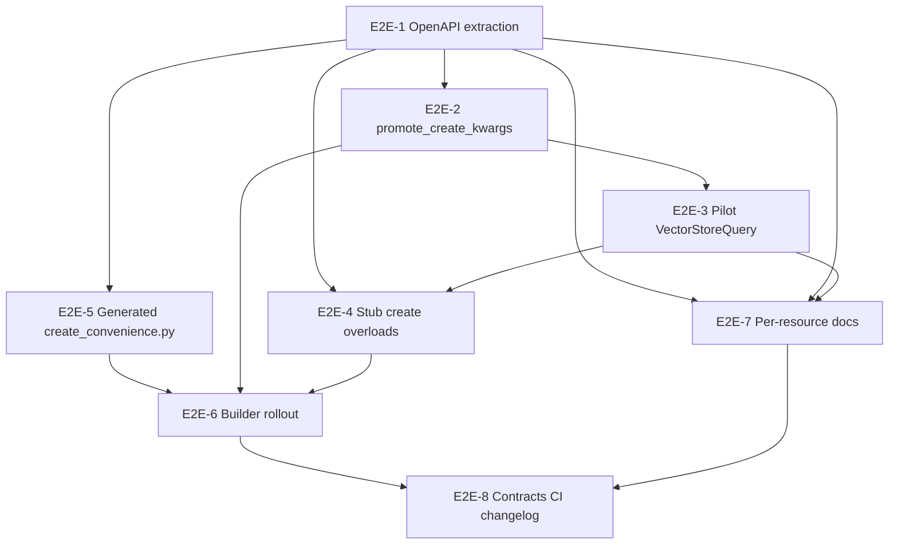

# E2E implementation plan: convenience kwargs + per-resource reference

**Parent:** [feat-create-convenience-kwargs-and-resource-reference.md](feat-create-convenience-kwargs-and-resource-reference.md)
**Branch:** `feat/create-convenience-kwargs-and-resource-docs`
**Audience:** Implementers running this feature to completion in one branch or a small PR stack.

This document is the **execution playbook**: ordered workstreams, file touch lists, tests per slice, verification commands, and a final end-to-end smoke path. It does not repeat rationale; see the parent plan for goals and non-goals.

---

## Scope snapshot

| Dimension | Count / note |
|-----------|----------------|
| Facade resources (`RESOURCE_REGISTRY`) | ~41 |
| Resources with `build_create_payload` | ~26 (`create-update-payloads.md`) |
| Resources with manual `spec_fields = (...)` today | 3 (`vector_store_query`, `query_vulnerability`, `query_malware`) |
| Generated markdown pages to add | ~41 under `docs/generated-reference/resources/` |

**Breaking change (intentional):** `create()` with unknown flat kwargs will raise `TypeError` after E2E-3. Document in [changelog.md](../changelog.md) under a minor release if any external caller relied on ignored kwargs.

---

## PR stack (recommended)

Split keeps reviewable diffs and green CI between merges. All branches target `feat/create-convenience-kwargs-and-resource-docs` or merge sequentially into it.

| PR | Workstreams | User-visible outcome |
|----|-------------|----------------------|
| **PR-1** | E2E-1, E2E-2 | Metadata in model-sync + contract; helper + tests; no behavior change yet |
| **PR-2** | E2E-3, E2E-4 | `VectorStoreQuery` + query resources; typed stubs pilot; strict kwargs |
| **PR-3** | E2E-5, E2E-6 | All builders migrated; full `client_surface.pyi` create overloads |
| **PR-4** | E2E-7, E2E-8 | Per-resource docs + index; contracts/changelog; CI gates |

Single-branch implementation is fine: follow workstreams **in order** and run the **slice verification** block after each.

---

## Dependency graph



---

## E2E-1 — OpenAPI → contract metadata (Side A foundation)

### Objective

Derive `create_convenience_spec_fields`, `create_convenience_meta_fields`, and `create_convenience_spec_required` from OpenAPI for every registry resource with a create body.

### Files to create / modify

| Action | Path |
|--------|------|
| Modify | `devtools/sync/contract.py` — add `extract_create_convenience_fields(spec_def) -> dict` and extend `build_payload_schemas()` output |
| Modify | `devtools/sync/contract.py` — `build_facade_contract()` copies new keys onto each resource row |
| Modify | `devtools/sync/contract.py` — `validate_*` / parity checks for new keys |
| Modify | `devtools/sync/cli.py` — wire if needed (usually automatic via existing pipeline) |
| Regen | `workspace/model-sync/custom_mapping/mapping/payload_schemas.json` |
| Regen | `src/endorlabs/generated/registry_contract.py` |
| Modify | `src/endorlabs/registry.py` — `ResourceEntry` + `_build_resource_registry()` load lists |
| Modify | `src/endorlabs/registry_overlay.py` — document override shape for `create_convenience_*` |
| Create | `tests/unit/devtools/sync/test_create_convenience_fields.py` |
| Create | `tests/fixtures/openapi/create_convenience_vector_store_query.json` (minimal swagger fragment) |
| Modify | `tests/unit/tooling/scripts/test_generated_contract_quality_gates.py` |

### Implementation steps

1. Add helper `_schema_properties(definitions, ref_name) -> dict` and `_writable_property_names(props) -> list[str]` (`readOnly: true` excluded).
2. For each create body in `build_payload_schemas`, resolve `spec` `$ref`; if missing or nested (`spec.request`), set convenience lists to `[]` and `convenience_skip_reason` string for docs.
3. For `meta`: if body has `meta` ref and `meta` not in body `required`, expose flat `name` when `v1Meta` has writable `name` (align with existing builders).
4. Order spec fields: required properties first (OpenAPI `required` on spec def), then optional alphabetical.
5. Extend parity validator: every resource with `create_mode=both` should have non-empty `create_convenience_spec_fields` OR documented `convenience_skip_reason`.
6. Run full model-sync locally (see verification).

### Tests (E2E-1)

- Fixture: `v1VectorStoreQuerySpec` → `["vector_store_uuid", "query", "metadata_filter"]`, excludes `matches`.
- Fixture: nested metadata-query spec → `[]` + skip reason.
- Contract gate: sample `RUNTIME_REGISTRY_CONTRACT` row includes new keys after regen.

### Slice verification

```bash
uv run pytest tests/unit/devtools/sync/test_create_convenience_fields.py -q
uv run python devtools/model_sync.py --generate-stubs
git diff --stat src/endorlabs/generated/registry_contract.py workspace/model-sync/
```

**Done when:** Regenerated contract committed; unit tests green; no manual edits inside `registry_contract.py`.

---

## E2E-2 — `promote_create_kwargs` helper (Side A core)

### Objective

Single promotion + strict unknown-kwarg policy; no resource wired yet (or wire only in tests).

### Files

| Action | Path |
|--------|------|
| Create | `src/endorlabs/utils/create_payload.py` |
| Modify | `src/endorlabs/utils/__init__.py` — export if public (optional; prefer internal import from resources) |
| Create | `tests/unit/utils/test_create_payload_promote.py` |

### API (stable)

```python
RESERVED_CREATE_KWARGS = frozenset({"namespace", "payload"})

def promote_create_kwargs(
    payload_kwargs: dict[str, Any],
    *,
    spec_fields: Sequence[str],
    meta_name_default: str | None = None,
    meta_flat_aliases: Mapping[str, str] | None = None,  # "name" -> "meta.name" internal
    resource_label: str = "resource",
) -> dict[str, Any]: ...
```

**Rules:**

1. If `payload` in kwargs → return early (caller handles mutual exclusion).
2. If `spec` absent → pop each `spec_fields` key from kwargs into `spec` dict.
3. If `meta` absent → build from `meta_name_default` and `meta_flat_aliases` (e.g. pop `name`).
4. Remaining keys minus `RESERVED_CREATE_KWARGS` → `TypeError` listing unexpected keys.

### Tests (E2E-2)

| Case | Expect |
|------|--------|
| Promote `vector_store_uuid`, `query`, `metadata_filter` | All under `spec` |
| Default meta name | `meta.name` set |
| `spec={...}` passthrough | No merge from flat keys |
| `unknown=1` | `TypeError` |
| `namespace` only left | OK (facade strips before builder) |

### Slice verification

```bash
uv run pytest tests/unit/utils/test_create_payload_promote.py -q
uv run ruff check src/endorlabs/utils/create_payload.py
uv run pyright src/endorlabs/utils/create_payload.py
```

---

## E2E-3 — Pilot runtime: `VectorStoreQuery` (Side A vertical slice)

### Objective

First resource end-to-end: flat `metadata_filter`, typed spec, drift allowlist, facade unit tests.

### Files

| Action | Path |
|--------|------|
| Modify | `src/endorlabs/resources/vector_store_query.py` |
| Modify | `tests/unit/resources/test_vector_store_query.py` |
| Modify | `tests/unit/client/test_client_facade.py` — optional create wiring test |
| Modify | `tests/integration/resources/test_vector_store_query.py` |

### Implementation steps

1. Regen E2E-1 artifacts if not already on branch.
2. Import spec field tuple from generated module (after E2E-5) **or** interim: duplicate list from contract test constant until E2E-5 lands.
3. Replace manual `spec_fields` loop with `promote_create_kwargs(..., spec_fields=VECTOR_STORE_QUERY_SPEC_FIELDS, meta_name_default="vector-store-query")`.
4. Add `metadata_filter: dict[str, Any] | None = Field(None, ...)` on `VectorStoreQuerySpec`.
5. Drift `known`: `vector_store_uuid`, `query`, `metadata_filter`, `matches`.
6. Unit: flat `metadata_filter` in `model_dump()["spec"]`; `typo=` raises `TypeError`.
7. Integration (skip-friendly): `create` with `metadata_filter={"repo": ...}` against `function_summary` via lookup + `VectorStoreQuery.create`.

### Slice verification

```bash
uv run pytest tests/unit/resources/test_vector_store_query.py tests/unit/utils/test_create_payload_promote.py -q
# Optional credentialed:
uv run pytest tests/integration/resources/test_vector_store_query.py -m writes -q
```

**Done when:** Acceptance criteria A1–A3 from parent plan pass for `VectorStoreQuery`.

---

## E2E-4 — Typed `create()` on `client_surface.pyi` (Side A typing)

### Objective

Pyright-visible per-resource `create()` for `create_mode=both` resources.

### Files

| Action | Path |
|--------|------|
| Modify | `devtools/generate_client_stub.py` — `_format_create_override(entry, contract_row)` |
| Regen | `src/endorlabs/client_surface.pyi` |
| Create | `tests/unit/devtools/test_client_surface_pyi_create_kwargs.py` |

### Implementation steps

1. Load contract row for each resource: `create_convenience_spec_fields`, `create_convenience_spec_required`, payload model name from builder return type (existing `_resolve_payload_model_from_builder` logic in reference doc generator — factor shared helper in `devtools/` if needed).
2. Map OpenAPI types to stub types: `string` → `str`, `object` → `dict[str, Any]`, `integer` → `int`, arrays → `list[...]`.
3. Emit on `_<Attr>Facade`:
   - `payload: CreateXPayload | None = None`
   - `*, name: str | None = ..., namespace: str | None = ...` (existing facade params)
   - One param per spec convenience field; required → no default; optional → `| None = ...`
4. Pilot test only `VectorStoreQuery` in PR-2; full regen in E2E-6.
5. CI already diffs `client_surface.pyi` — no workflow change required.

### Tests (E2E-4)

- Parse generated pyi; assert `def create` on `_VectorStoreQueryFacade` contains `metadata_filter`.
- Assert `QueryVulnerability` create includes known spec fields from fixture contract row.

### Slice verification

```bash
uv run python devtools/generate_client_stub.py
uv run pytest tests/unit/devtools/test_client_surface_pyi_create_kwargs.py -q
uv run pyright src/endorlabs/client_surface.py
```

---

## E2E-5 — Generated `create_convenience.py` (Side A scale)

### Objective

Avoid 26 hand-maintained `spec_fields` tuples; single generated constants module.

### Files

| Action | Path |
|--------|------|
| Modify | `devtools/sync/contract.py` — `render_create_convenience_module(facade_contract) -> str` |
| Modify | `devtools/sync/cli.py` — write `src/endorlabs/generated/create_convenience.py` |
| Regen | `src/endorlabs/generated/create_convenience.py` |
| Modify | `src/endorlabs/generated/README.md` — document module |

### Generated shape (example)

```python
# generated by model-sync
VECTOR_STORE_QUERY_SPEC_FIELDS = ("vector_store_uuid", "query", "metadata_filter")
VECTOR_STORE_QUERY_META_NAME_DEFAULT = "vector-store-query"
```

### Slice verification

```bash
uv run python devtools/model_sync.py --generate-stubs
uv run python -c "from endorlabs.generated.create_convenience import VECTOR_STORE_QUERY_SPEC_FIELDS; print(VECTOR_STORE_QUERY_SPEC_FIELDS)"
```

---

## E2E-6 — Builder rollout + full stub regen (Side A complete)

### Objective

All `build_create_payload` functions use `promote_create_kwargs` + generated constants; full pyi overloads.

### Files (batch)

| Action | Path |
|--------|------|
| Modify | All `src/endorlabs/resources/*` with `build_create_payload` (~26 files) |
| Modify | `query_vulnerability.py`, `query_malware.py` — replace manual `spec_fields` |
| Regen | `src/endorlabs/client_surface.pyi` |
| Modify | `tests/unit/resources/` — add parametrized test or spot-check 2–3 complex builders (`Policy`, `Finding`, `Project`) |

### Rollout strategy

1. **Tier 1 — Query resources (3):** `vector_store_query`, `query_vulnerability`, `query_malware` (already partial).
2. **Tier 2 — Simple meta+spec (≈10):** `api_key`, `invitation`, `code_owners`, `namespace`, … — verify OpenAPI lists match current behavior.
3. **Tier 3 — Complex spec (remaining):** `policy`, `finding`, `project`, `scan_result`, … — run existing unit tests per module; fix overlays where OpenAPI superset > hand-written model (use `spec=` passthrough; optional fields on models via `extra="allow"`).

### Special cases

| Resource | Note |
|----------|------|
| Builders that already require `payload` only | `create_mode=payload-only` — no stub overload change |
| Builders with custom pre-processing before spec | Keep preprocessing; call `promote_create_kwargs` on remainder |
| OpenAPI skip (`convenience_skip_reason`) | Keep legacy builder; stub stays `**kwargs: Any` |

### Tests (E2E-6)

- Parametrized: for each Tier-1 resource, contract spec fields ⊆ promoted keys in golden test.
- Run existing `tests/unit/resources/test_*.py` touching create builders (no regressions).
- `tests/unit/client/test_client_facade.py` — smoke `create` mock path for 1–2 resources.

### Slice verification

```bash
uv run pytest tests/unit/resources/ tests/unit/client/test_client_facade.py -q
uv run python devtools/generate_client_stub.py
uv run pyright
```

---

## E2E-7 — Per-resource reference pages (Side B complete)

### Objective

Generated discoverability for agents and humans; CI enforces freshness.

### Files

| Action | Path |
|--------|------|
| Create | `devtools/generate_resource_reference_pages.py` (or extend `generate_reference_docs.py`) |
| Regen | `docs/generated-reference/resources/*.md` (~41 files) |
| Regen | `docs/generated-reference/resources/README.md` |
| Regen | `docs/generated-reference/index.json` (optional) |
| Create | `src/endorlabs/generated/resource_index.json` + `pyproject.toml` `artifacts` |
| Modify | `src/endorlabs/generated/README.md` |
| Modify | `docs/README.md`, `docs/reference/README.md`, root `README.md` |
| Modify | `.github/workflows/ci-pr-main.yml` — diff check for `docs/generated-reference/resources/` |
| Modify | `docs/contributing/docs-drift-workflow.md` |
| Create | `tests/unit/devtools/test_generate_resource_reference_pages.py` |
| Create | `tests/fixtures/generated-reference/VectorStoreQuery.md` (golden subset) |

### Page generator inputs

| Section | Source |
|---------|--------|
| Ops / path / scope | `RESOURCE_REGISTRY` + `coverage.json` |
| Convenience kwargs | `create_convenience_spec_fields` + meta flat aliases |
| Read-only response spec fields | OpenAPI spec def where `readOnly: true` |
| Payload model | Builder return type annotation |
| Examples | Template filled with first required spec fields |
| Related | Static map in `devtools/model_sync_profiles/resource_related.json` (new, small) |

### `VectorStoreQuery.md` must include

- `client.VectorStoreQuery.create`
- Convenience: `vector_store_uuid`, `query`, `metadata_filter`
- Response: `spec.matches`
- Related: `VectorStore`, `VectorStore.query()`
- endorctl example with `function_summary` note (store by name, not `cwe_knowledge` UUID)

### Slice verification

```bash
uv run python devtools/generate_reference_docs.py
# or combined:
uv run python devtools/model_sync.py --generate-reference-docs
test -f docs/generated-reference/resources/VectorStoreQuery.md
uv run pytest tests/unit/devtools/test_generate_resource_reference_pages.py -q
```

---

## E2E-8 — Contracts, changelog, final E2E smoke

### Objective

Normative docs updated; changelog entry; one scripted path proving Side A + B together.

### Files

| Action | Path |
|--------|------|
| Modify | `docs/contracts.md` — create kwargs MUST match generated lists; unknown MUST error |
| Modify | `docs/guides/consumer-ux-list-update.md` — link per-resource pages |
| Modify | `docs/changelog.md` — behavior change + migration note |
| Modify | `docs/design/feat-create-convenience-kwargs-and-resource-reference.md` — status → Implemented |

### Final E2E smoke (local)

```bash
# 1) Regenerate all artifacts
uv run python devtools/model_sync.py --fetch-spec --generate-stubs --generate-reference-docs
uv run python devtools/generate_client_stub.py

# 2) Static checks (matches CI)
uv run ruff check .
uv run ruff format --check .
uv run pyright

# 3) Targeted tests
uv run pytest \
  tests/unit/devtools/sync/test_create_convenience_fields.py \
  tests/unit/utils/test_create_payload_promote.py \
  tests/unit/resources/test_vector_store_query.py \
  tests/unit/devtools/test_client_surface_pyi_create_kwargs.py \
  tests/unit/devtools/test_generate_resource_reference_pages.py \
  -q

# 4) Agent discoverability spot-check
rg "metadata_filter" docs/generated-reference/resources/VectorStoreQuery.md
rg "metadata_filter" src/endorlabs/client_surface.pyi

# 5) Optional live API (credentials)
uv run --env-file .env python -c "
import endorlabs
c = endorlabs.Client()
vs = c.VectorStore.lookup(name='function_summary')
r = c.VectorStoreQuery.create(
    vector_store_uuid=vs.uuid,
    query='Functions that handle logging',
    metadata_filter={'repo': 'https://github.com/endorlabs/endorlabs-sdk.git'},
    namespace=vs.namespace,
)
assert r.spec is not None
print('matches', len(r.spec.model_dump().get('matches') or []))
"
```

### CI acceptance (full PR)

- `ci-pr-main.yml` green: ruff, pyright, pytest, stub diff, generated docs diff, model-sync upstream verify if spec fetched.

---

## Test matrix (consolidated)

| ID | Layer | File | Workstream |
|----|-------|------|------------|
| T1 | unit | `tests/unit/devtools/sync/test_create_convenience_fields.py` | E2E-1 |
| T2 | unit | `tests/unit/utils/test_create_payload_promote.py` | E2E-2 |
| T3 | unit | `tests/unit/resources/test_vector_store_query.py` | E2E-3 |
| T4 | unit | `tests/unit/devtools/test_client_surface_pyi_create_kwargs.py` | E2E-4 |
| T5 | unit | contract quality gates | E2E-1 |
| T6 | unit | parametrized builder / resource tests | E2E-6 |
| T7 | unit | `tests/unit/devtools/test_generate_resource_reference_pages.py` | E2E-7 |
| T8 | integration | `tests/integration/resources/test_vector_store_query.py` | E2E-3 |
| T9 | golden | `tests/fixtures/generated-reference/VectorStoreQuery.md` | E2E-7 |
| T10 | CI | workflow diff gates | E2E-7, E2E-8 |

---

## Agent / PyPI discoverability (E2E outcome)

After E2E-8, an agent with **only** `pip install endorlabs-sdk` gets:

| Mechanism | What it sees |
|-----------|----------------|
| Pyright / Pylance | `client.VectorStoreQuery.create(..., metadata_filter=...)` from pyi |
| Wheel | `generated/resource_index.json` → doc paths + spec fields |
| Repo / GitHub | `docs/generated-reference/resources/VectorStoreQuery.md` |
| Runtime | `TypeError` on typos (fail fast) |
| `extra="allow"` on specs | Response fields not in hand-written model still parse |

Agents without IDE still benefit from **generated markdown + JSON index** committed to the repo; link from root README.

---

## Out of scope for this E2E (follow-ups)

- `VectorStoreMetadataQuery` facade
- Auto-generating hand-written `resources/*.py` from OpenAPI
- Shipping full markdown inside the wheel (index JSON only unless product asks)
- `VectorStore.query()` accepting `metadata_filter` (delegate kwargs in separate small PR)

---

## Checklist (ship)

Copy into PR description and tick:

```
[ ] E2E-1 contract metadata regen
[ ] E2E-2 promote_create_kwargs + tests
[ ] E2E-3 VectorStoreQuery pilot + integration
[ ] E2E-4 stub create() pilot → full regen
[ ] E2E-5 create_convenience.py generated
[ ] E2E-6 all builders migrated
[ ] E2E-7 per-resource docs + CI diff
[ ] E2E-8 contracts + changelog + smoke script
```
