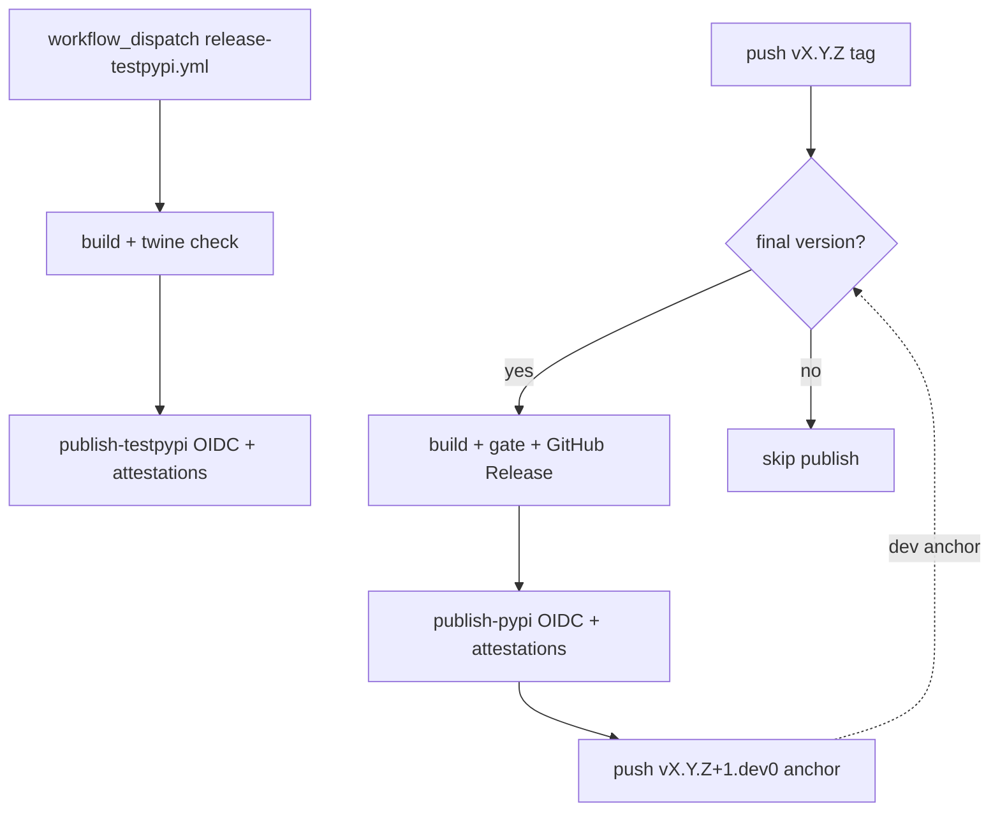

# PyPI / TestPyPI publication (maintainer guide)

> **Status:** Release automation is implemented in CI. Configure Trusted Publishing on
> TestPyPI and PyPI before the first upload (pending publishers are supported for new
> projects).

## Root cause of the hatch-vcs failure

`hatch-vcs` delegates to **setuptools-scm**. SCM computes post-tag versions as
`{tag_base}.dev{N}` where **N = commits since the tag**.

That only works when the tag ends in **`.dev0`** (dev-series anchor), e.g. `v0.1.1.dev0` →
`0.1.1.dev4` four commits later.

Tags like **`v0.1.1.dev19`** encode “dev 19” in the tag itself. SCM then refuses to bump
(“choosing custom numbers for the `.devX` distance is not supported”) and **`uv sync` /
editable installs fail**—the error in local Endor scans against `pypi://endorlabs@…`.

**Repo fix (in `pyproject.toml`):**

1. **`[tool.hatch.version.raw-options].git_describe_command`** — development trees describe only
   `v*.*.*.dev0` anchors (so `0.1.1.dev23`, not `0.1.1.dev19` from a bad tag).
2. **Release CI** — `.github/workflows/release-tag-publish.yml` sets
   `SETUPTOOLS_SCM_PRETEND_VERSION` from the pushed tag (`v0.1.0` → `0.1.0`) so wheels are
   exactly the release version, not a `.devN` distance.
3. **`local_scheme = "no-local-version"`** — wheels do not get `+g<hash>` suffixes (PyPI-friendly).
4. Do **not** put `tag-pattern` on `[tool.hatch.version]` with a group that includes `.dev0` in the
   captured version (e.g. `0.1.1.dev0`) — setuptools-scm treats that as a custom dev id and fails.

Nearest valid anchor today: **`v0.1.1.dev0`** → working tree versions like `0.1.1.devN`.

**Remote tag hygiene (recommended):** delete or stop creating tags that break SCM
(`v0.1.1.dev19`, `v0.1.0.dev1`, `v0.1.0-test.*`, `v0.1.1.dev-build.*`). The describe command
mitigates them, but cleaning the remote avoids confusion for other tools (Endor scans, `git describe`).

## PEP 440 and PyPI rules (summary)

| Rule | Practice for this package |
|------|---------------------------|
| Public release versions | `X.Y.Z` only on PyPI (e.g. `0.1.0`)—tag `v0.1.0` at the release commit |
| Pre-releases | `X.Y.Za1`, `X.Y.Zb1`, `X.Y.Zrc1` if needed; tag `v0.2.0rc1` |
| Dev series (local/TestPyPI only) | Anchor `vX.Y.Z.dev0`; SCM emits `X.Y.Z.devN` between anchors |
| **Do not** use custom `.devN` in tags | No `v0.1.1.dev19`—use git distance instead |
| Local segments `+gHASH` | Stripped for wheels via `local_scheme = "no-local-version"` in `pyproject.toml` |
| TestPyPI | Same version strings; upload there first, smoke-install, then PyPI |

PyPI rejects many local-version forms on upload; **release builds must be cut from a
release tag** (`vX.Y.Z`), not from a random branch with a `.devN` version.

## Package metadata checklist (PEP-anchored)

| Requirement | Status in `pyproject.toml` |
|-------------|---------------------------|
| `[build-system]` pinned backend (PEP 518/517) | `hatchling==1.28.0`, `hatch-vcs` |
| `[project]` name, description, readme, requires-python, authors (PEP 621) | Present |
| Dependencies as PEP 508 strings | Present (pinned `==` for reproducibility) |
| License SPDX + `license-files` (PEP 639, metadata 2.4) | `license = "MIT"`, `license-files = ["LICENSE"]` |
| `[project.urls]` Homepage, Repository, Documentation, Changelog, Issues | Present |
| Version via PEP 440 tags | Dynamic (`hatch-vcs`); no static version in tree |

## Git tag policy

### Production (PyPI)

```text
vMAJOR.MINOR.PATCH     →  version MAJOR.MINOR.PATCH   (e.g. v0.1.0 → 0.1.0)
vMAJOR.MINOR.PATCHrcN  →  version MAJOR.MINOR.PATCHrcN (publish skipped by default)
```

### Development series (not published to PyPI)

```text
vMAJOR.MINOR.PATCH.dev0   →  anchor only; SCM produces MAJOR.MINOR.PATCH.devN after it
```

After a successful **final** PyPI publish, CI pushes the next dev anchor automatically
(e.g. release `v0.1.1` → anchor `v0.1.2.dev0`).

### Avoid (break SCM or are ignored by git_describe_command)

```text
v0.1.1.dev19
v0.1.0.dev1
v0.1.0-test.20260511.1
v0.1.1.dev-build.20260519.1
```

## Trusted Publishing setup (free — no API tokens)

Configure **pending** publishers before the first upload to each index.

### TestPyPI (test.pypi.org)

1. Sign in → **Account settings** → **Publishing** → **Add a new pending publisher**
2. **PyPI project name:** `endorlabs`
3. **GitHub owner:** `endorlabs`
4. **Repository name:** `endorlabs-sdk`
5. **Workflow name:** `release-testpypi.yml`
6. **Environment name:** `testpypi`

### PyPI (pypi.org — production, configure before first prod release)

1. Same steps on pypi.org → **Publishing**
2. **Workflow name:** `release-tag-publish.yml`
3. **Environment name:** `pypi`

### GitHub Environments (Settings → Environments)

| Environment | Used by | Recommended protection |
|-------------|---------|------------------------|
| `testpypi` | `release-testpypi.yml` | Optional reviewers |
| `pypi` | `release-tag-publish.yml` | Required reviewers |

No `PYPI_API_TOKEN` or `TEST_PYPI_API_TOKEN` secrets are used. OIDC + PEP 740 attestations
are handled by `pypa/gh-action-pypi-publish` pinned to a release commit SHA (attestations on by default).

Pin the action to the **git commit SHA** for a release (e.g. `@cef22109… # v1.14.0`), not `@release/v1` (moving branch; Endor “Block Misconfigured GHAs”) and not a **tag object SHA** (PyPA publishes `ghcr.io` images keyed by commit SHA only — tag object SHAs cause `manifest unknown`).

## Local verification (before any upload)

```bash
# From repo root, full git history (tags)
git fetch --tags

# Should print a PEP 440 version (no setuptools-scm error)
uv run python devtools/check_vcs_version.py

# Editable install path used by uv sync / Endor scans
uv sync --dev

# Build release artifacts (set version explicitly for local release simulation)
# PowerShell:
$env:SETUPTOOLS_SCM_PRETEND_VERSION = "0.1.1"
# bash:
# export SETUPTOOLS_SCM_PRETEND_VERSION=0.1.1

uv build
uv run twine check dist/*
uv run python devtools/smoke_test_wheel.py
```

Do not publish wheels built with `SETUPTOOLS_SCM_PRETEND_VERSION` unless CI also sets the
same version from a tag or workflow input.

## CI workflows

### TestPyPI — `.github/workflows/release-testpypi.yml`

- **Trigger:** `workflow_dispatch` with inputs `version` (required) and `ref` (default `main`)
- **Build job:** quality checks via `check_vcs_version.py`, `uv build`, `twine check`, upload artifact
- **Publish job:** `environment: testpypi`, `permissions: id-token: write`, OIDC publish to TestPyPI

### Production PyPI — `.github/workflows/release-tag-publish.yml`

- **Trigger:** push tag matching `v*`
- **Classify:** final releases match `vX.Y.Z` exactly; dev anchors and pre-releases skip publish
- **Build job (final only):** full quality gate, model-sync drift checks, `uv build`, `twine check`, GitHub Release
- **Publish job (final only):** `environment: pypi`, OIDC publish to PyPI with attestations
- **Post-release bump (final only):** pushes `vX.Y.(Z+1).dev0` dev anchor tag



## TestPyPI validation plan (OIDC + attestations)

Run this once after merging the release workflows and configuring the pending TestPyPI publisher.

### 1. Publish `0.1.1` to TestPyPI

1. Merge release automation to `main`
2. Configure pending TestPyPI publisher + GitHub `testpypi` environment (above)
3. **Actions → Release TestPyPI Publish → Run workflow**
   - `version`: `0.1.1`
   - `ref`: `main`
4. Confirm the publish job log shows OIDC token exchange (no username/password/token env vars)
5. Open `https://test.pypi.org/project/endorlabs/0.1.1/` and verify **Verified details** / provenance

### 2. Smoke install from TestPyPI

```bash
python -m venv /tmp/endorlabs-smoke
# Windows: /tmp/endorlabs-smoke/Scripts/python
# Unix:    /tmp/endorlabs-smoke/bin/python

python -m pip install \
  --index-url https://test.pypi.org/simple/ \
  --extra-index-url https://pypi.org/simple/ \
  endorlabs==0.1.1

python -c "import endorlabs; from endorlabs import Client; print(endorlabs.__version__)"
# Expected: 0.1.1
```

Or after a TestPyPI publish:

```bash
uv run python devtools/smoke_test_published_install.py --version 0.1.1
```

### 3. Publish patch `0.1.2` to TestPyPI

Repeat step 1 with `version: 0.1.2` (confirms OIDC + attestations on a second upload).

### 4. Production PyPI (when ready)

1. Configure pending publisher on pypi.org for `release-tag-publish.yml` / environment `pypi`
2. Tag a final release: `git tag -a vX.Y.Z -m "Release X.Y.Z" && git push origin vX.Y.Z`
3. Wait for **Release Tag Publish** workflow; confirm PyPI provenance and GitHub Release assets
4. Confirm CI pushed the next dev anchor tag (`vX.Y.(Z+1).dev0`)

Production first-release version (0.x vs 1.0.0) is a product decision—defer until ready.

## Related files

- Version config: `pyproject.toml` → `[tool.hatch.version]`, `[tool.hatch.build.hooks.vcs]`
- Generated at build: `src/endorlabs/_version.py` (gitignored)
- Release CI: `.github/workflows/release-tag-publish.yml`, `.github/workflows/release-testpypi.yml`
- Local helpers: `devtools/check_vcs_version.py`, `devtools/smoke_test_wheel.py`, `devtools/smoke_test_published_install.py`
